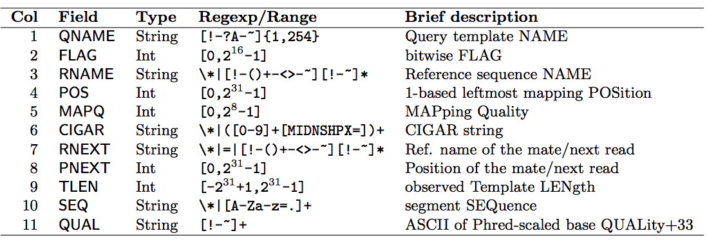
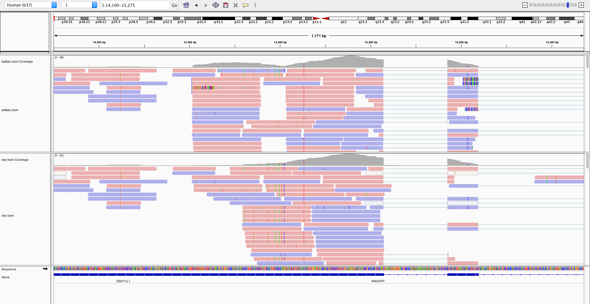
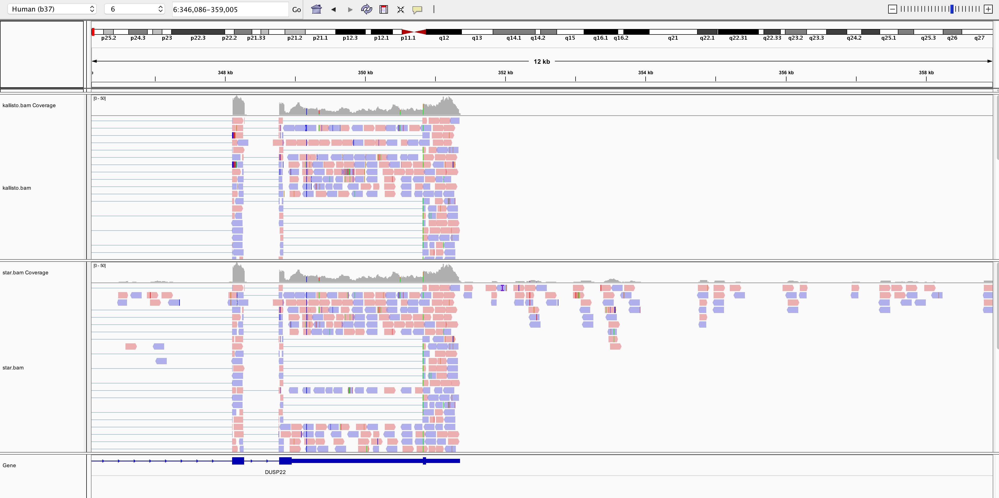
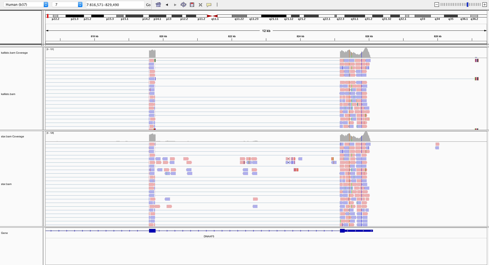
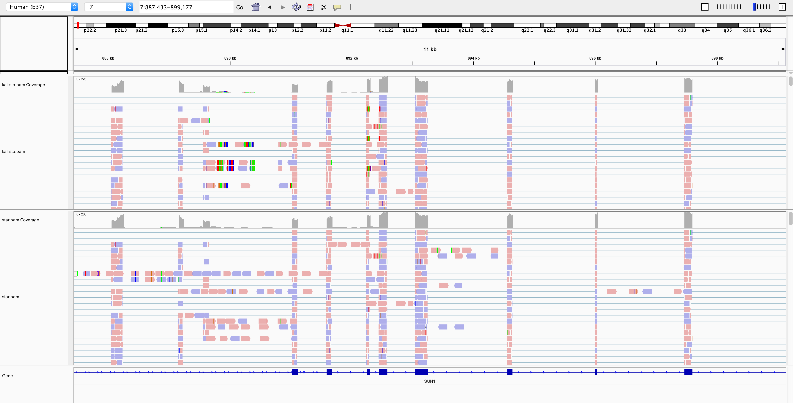
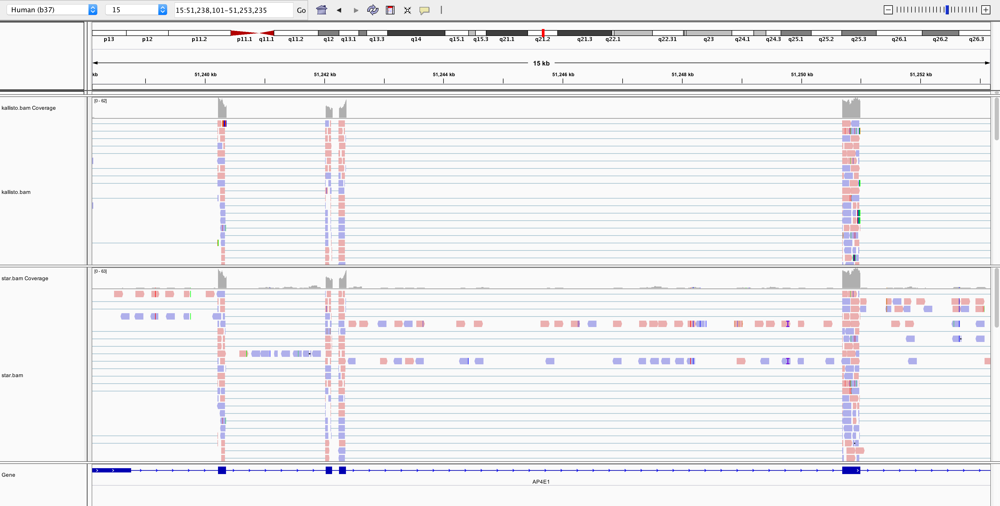
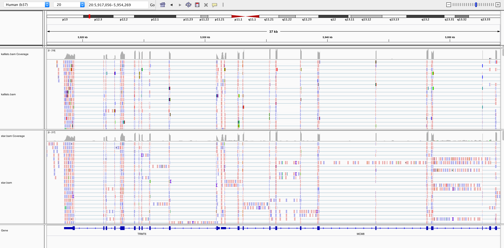
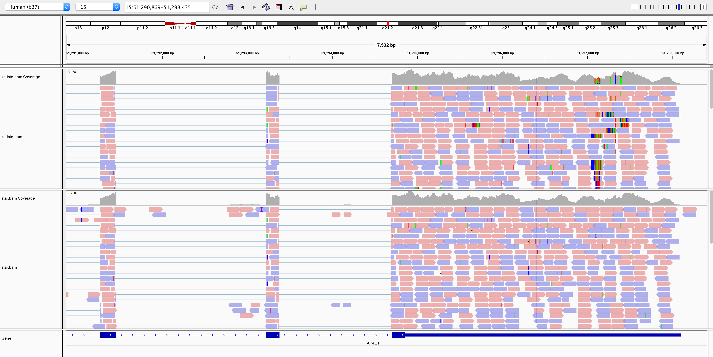
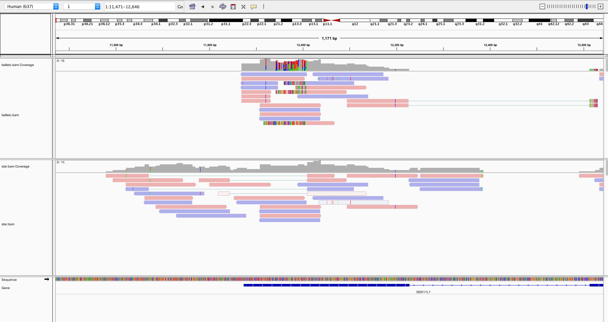
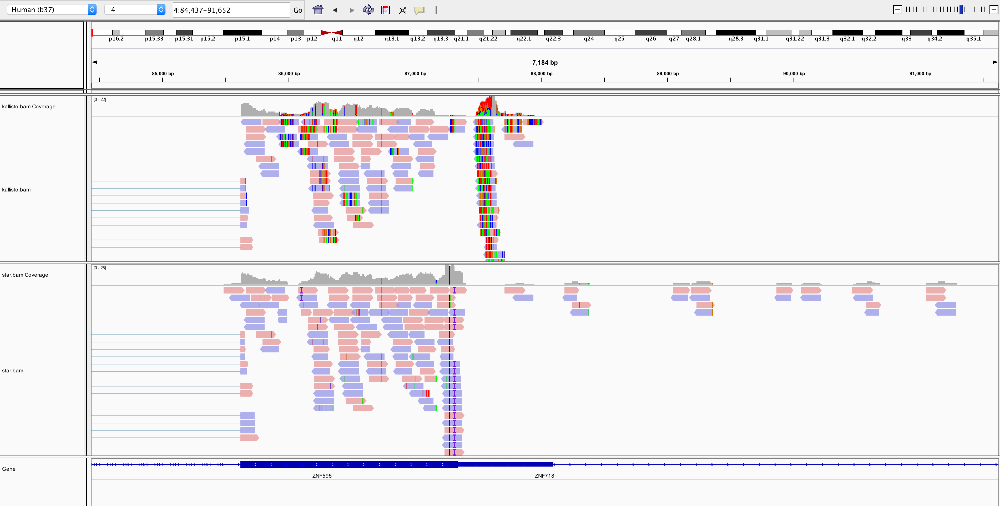

This documents summarizes the activity of eye balling through the bam files that are generated using STAR (Spliced Transcripts Alignment to a Reference) and Kallisto (kmers alone lose lots of information; strong together only).

## STAR:

The star bam is created using bcbio config file and is located on Spartan under:

```
/data/cephfs/punim0010/projects/Kanwal_RNASeq_Testing/seqc-test/rna-seq/work/align/RNA-Test-kallisto/
RNA-Test-kallisto_star/RNA-Test-kallisto.bam`. 
```
The following command is used by bcbio to generate the bam file.

```
/data/cephfs/punim0010/local/development/bcbio/galaxy/../anaconda/bin/STAR --genomeDir /data/cephfs/punim0010/local/development/bcbio/genomes/Hsapiens/GRCh37/star/ --readFilesIn <(gunzip -c /data/cephfs/punim0010/projects/Kanwal_RNASeq_Testing/rna_data/merged/sample1_R1.fastq.gz) <(gunzip -c /data/cephfs/punim0010/projects/Kanwal_RNASeq_Testing/rna_data/merged/sample1_R2.fastq.gz) --runThreadN 8 --outFileNamePrefix /data/cephfs/punim0010/projects/Kanwal_RNASeq_Testing/seqc-test/rna-seq/config/bcbiotx/tmpn7KsNK/RNA-Test-kallisto/RNA-Test-kallisto --outReadsUnmapped Fastx --outFilterMultimapNmax 10 --outStd BAM_Unsorted  --limitOutSJcollapsed 2000000 --outSAMtype BAM Unsorted --outSAMmapqUnique 60 --outSAMunmapped Within --outSAMattributes NH HI NM MD AS  --sjdbGTFfile /data/cephfs/punim0010/local/development/bcbio/genomes/Hsapiens/GRCh37/rnaseq/ref-transcripts.gtf  --sjdbOverhang 150  --outSAMattrRGline ID:RNA-Test-kallisto PL:illumina PU:RNA-Test-kallisto SM:RNA-Test-kallisto  --chimSegmentMin 12 --chimJunctionOverhangMin 12 --chimScoreDropMax 30 --chimSegmentReadGapMax 5 --chimScoreSeparation 5 --chimOutType WithinBAM  --outSAMstrandField intronMotif  --quantMode TranscriptomeSAM  | /data/cephfs/punim0010/local/development/bcbio/galaxy/../anaconda/bin/samtools sort -@ 8 -m 6G  -T /data/cephfs/punim0010/projects/Kanwal_RNASeq_Testing/seqc-test/rna-seq/config/bcbiotx/tmpn7KsNK/RNA-Test-kallisto/RNA-Test-kallisto_star/RNA-Test-kallisto-sorttmp -o /data/cephfs/punim0010/projects/Kanwal_RNASeq_Testing/seqc-test/rna-seq/config/bcbiotx/tmpn7KsNK/RNA-Test-kallisto/RNA-Test-kallisto_star/RNA-Test-kallisto.bam /dev/stdin > /data/cephfs/punim0010/projects/Kanwal_RNASeq_Testing/seqc-test/rna-seq/config/bcbiotx/tmpn7KsNK/RNA-Test-kallisto/RNA-Test-kallisto_star/RNA-Test-kallisto.bam
```

The resultant bam file from star is coordinate sorted.

`samtools view -H RNA-Test-kallisto.bam | grep "SO"`

```
@HD	VN:1.4	SO:coordinate
```

The first few alignments in this file are:

```
A00130:39:H5GWHDMXX:1:1336:2437:9502    355     1       10816   3       1S149M1S        =       10880   201     CCGGGGTGGAGGCGTGGCGCAGGCGCAGAGAGGCGCGCCGCGCCGGCGCAGGCGCAGAGACACAAGCTACCGCGTCCAGGGGTGGAGGCGTGGCGCAGGCGCAGAGAGGCTCACCGCCCCGCCGCGGGCGCGGAGGCACATGCGAGCGCGG FFFFFFFFFFFFFFFFFFFFFFFFFFFFFFF:FF::FFF,:,FFF:FFFF,F:,FFFF,:FFFF::FFFF:F,,,:F,:FF:,,,:F,F,FF,F,FFFFFF::FF:F:FF,F,FF:,,:FF,,F,,FFFFF:F,:,F,FF,FF:,:,F,F: NH:i:2  HI:i:2  NM:i:8  MD:Z:63T45G6G3G3A5A3A7T6        AS:i:264        RG:Z:RNA-Test-kallisto
A00130:39:H5GWHDMXX:1:1336:2437:9502    403     1       10880   3       14S137M =       10816   -201    GCGCCCCCCCCCCCGCTACCGCGCCCAGGGGTGGAGGCGTGGCGCAGGCGCAGAGAGGCGCCCCGCGCCGGCGCAGGCGCAGAGACACATGCTAGCGCGTCCAGGGGTGGAGGCGTGGCGCAGGCGCAGAGACGCAAGCCTACGGGCGGGG ,F,F,,:,,:,F:F,F,,FFFF,,F:,FFFF,FF,FFF,:F:FFF:::FFF:F,:F:,FFF,FFFF::FFFFFF,FFF:FFF:F,,FF,,FFF:,FFFF::FFFFFFFFFFFFFFFFFFFFFFFFFFFFFFFFFFFFFFFFFFFFFFFFFF NH:i:2  HI:i:2  NM:i:2  MD:Z:9T37A89    AS:i:264        RG:Z:RNA-Test-kallisto
A00130:39:H5GWHDMXX:1:1419:2239:1673    419     1       11138   1       87M     =       11138   87      CCTCAGTAATCAGAAAAGCCGGGCTCGGCCGCCCCTTGCTTGCAGCCGGGCACTACAGGACCGGCTTGCTCACGGTGCTGTGCCAGG FFFFFFFFFFFFFFFFFFFF:FFFFFFFFFFFFFFFFFFFFFFFFFFF:FFFFFFFFFFFFFFFFFFFFFFFFFFFFFFFFFFFFFF NH:i:3  HI:i:2  NM:i:4  MD:Z:11C11A3A34C24      AS:i:156        RG:Z:RNA-Test-kallisto
A00130:39:H5GWHDMXX:1:1419:2239:1673    339     1       11138   1       87M     =       11138   -87     CCTCAGTAATCAGAAAAGCCGGGCTCGGCCGCCCCTTGCTTGCAGCCGGGCACTACAGGACCGGCTTGCTCACGGTGCTGTGCCAGG F:FFFFFF:F:FFFFFFF:,:F::FFFFFF:FFFF::F,FFF,:FFF:FFFF,F:F,:,F:FFF:FF::FFFFF:FF,FFFFFF,FF NH:i:3  HI:i:2  NM:i:4  MD:Z:11C11A3A34C24      AS:i:156        RG:Z:RNA-Test-kallisto
```
The command used to run star also generates a bam file aligned to transcriptome `RNA-Test-kallisto.transcriptome.bam`. I couldn't work out how exactly is this file generated but suspect it is the result of star alignment.

The first few alignments in this file are:

```
A00130:39:H5GWHDMXX:1:1101:7274:1125    163     ENST00000555379 2551    60      151M    =       2560    160     GTGCCTTCTAAATATCTTTTGAATAGTTTTACTTCTCTCCATCTTGACAGCTACCATGCCAATCCAAGCTTCCATCACCTTGCTCCTGGCTTACTGCAGTATCCTCCTGTCTACCCTTCATCCACTTTTATCTCTTTCCAATCACTTGTTC FFFFFFFFFFFFFFFFFFFFFFFFFFFFFFFFFFFFFFFFFFFFFFFFFFFFFFFFFFFFFFFFFFFFFFFFFFFFFFFFFFFFFFFFFFFFFFFFFFFFFFFFFFFFFFFFFFFFFFFFFF:FFFF:FFFFFFFFFFFFFFFFFF:FFFF NH:i:1  HI:i:1  RG:Z:RNA-Test-kallisto
A00130:39:H5GWHDMXX:1:1101:7274:1125    83      ENST00000555379 2560    60      151M    =       2551    -160    AAATATCTTTTGAATAGTTTTACTTCTCTCCATCTTGACAGCTACCATGCCAATCCAAGCTTCCATCACCTTGCTCCTGGCTTACTGCAGTATCCTCCTGTCTACCCTTCATCCACTTTTATCTCTTTCCAATCACTTGTTCATACAACAG FFFFFFFFFFFFFF:FF:FFFFFFFFFFFFFFFFFFFFFFFFFFFFFFFFFFFFFFFFFF:FFFFFFFFFFFFFFFFFFFFFFFFFFFFFFFFFFFFFFFFFFFFFFFFFFFFFFFFFFFFFFFFFFFFFFFFFFFFFFFFFFFFFFFFFF NH:i:1  HI:i:1  RG:Z:RNA-Test-kallisto
A00130:39:H5GWHDMXX:1:1101:18548:1141   83      ENST00000217893 1006    1       151M    =       990     -167    AATCATCAAATGCATTGAAAAGAAAACGTGAAGATGATGATGATGACGATGATGATGATGATGACTATGATAATCTGTAATCTAGCCTTGCTGAATGTAACATGTATACTTGGTCTTGAATTCATTGTACTGATATTAAACATGCATGCTG FFFFFFFFFFFFFFFF,F:FFFFFFFFFFFFFFFFFF:FFFFFFFFFFFFFFFFFFFFFFFFFFFFFFFFFFFFFFFFFFFFFFFFFFFFFFFFFFFFFFFFFFFFFFFFFFFFFFFFFFFFFFFFFFFFFFFFFFFFFFFFFFFFFFFFF NH:i:3  HI:i:1  RG:Z:RNA-Test-kallisto
A00130:39:H5GWHDMXX:1:1101:18548:1141   419     ENST00000328663 1167    1       150M    =       1183    167     CAAAATACTGCCAATGAATCATCAAATGCATTGAAAAGAAAACGTGAAGATGATGATGATGACGATGATGATGATGATGACTATGATAATCTGTAATCTAGCCTTGCTGAATGTAACATGTATACTTGGTCTTGAATTCATTGTACTGAT  FFFFFFFFFFFFFFFFFFFFFFF:FFFFFFFFFFFFFFFFFFFFFFFFFFFFF:FFFFFFFFFFFFFFFFFFFFFFFFFFFFFFFFFFFFFFFFFFFFFFFFFFF:FFFFFFFFFFFFFFFFFFFFFFFFFFFFFFFFFFFFFFFFFFFF  NH:i:3  HI:i:2  RG:Z:RNA-Test-kallisto
```

## Kallisto:

Bcbio does not support generating pseudo-bam file from kallisto. So, this step was performed outside of bcbio but using bcbio's kallisto package. The following command generated the pseudobam file.

```
/data/cephfs/punim0010/local/development/bcbio/anaconda/bin/kallisto quant --pseudobam -o /data/cephfs/punim0010/projects/Kanwal_RNASeq_Testing/seqc-test/rna-seq/work/kallisto/RNA-Test-kallisto/pseudoalignment -i /data/cephfs/punim0010/projects/Kanwal_RNASeq_Testing/seqc-test/rna-seq/work/kallisto/index/GRCh37/GRCh37.idx /data/cephfs/punim0010/projects/Kanwal_RNASeq_Testing/rna_data/merged/sample1_R1.fastq.gz /data/cephfs/punim0010/projects/Kanwal_RNASeq_Testing/rna_data/merged/sample1_R2.fastq.gz | samtools view -Sb - > kallisto.bam
```

The bam file is located on spartan under:
```
/data/cephfs/punim0010/projects/Kanwal_RNASeq_Testing/seqc-test/rna-seq/work/kallisto/RNA-Test-kallisto
```

The resultant bam file does not have a "SO" in the header. So coordinate sorted it using:

```
samtools view -o kallisto-csorted.bam kallisto.bam
```

The first few alignments in this file are:

```
A00130:39:H5GWHDMXX:1:1265:23746:27398  99      ENST00000456328 1       255     88S63M  =       1       229     CTTCTTTCTGTTCATGTGTATTTGCTGTTCCTGCATGTAGTTTAAACGAGATTGCCAGCACCGGGTATCATTCACCATTTTTCTTTTCGTTAACTTGCCGTCAGCCTTTTCTTTGACCTCTTCTTTCTGTTCATGTGTATTTGCTGTCTCT FFFFFFFFFFFFFFFFFFFFFFFFFFFFFFFFFFFFFFFFFFFFF,FFFFFFFFFFFFFFFFFFFFFFFFFFFFFFFFFFFFFFFFFFFFFFFFFFFFFFFFFFFFFFFFFFFFF:FFFFFFFFFFFFFFFF:FFFFFFFFFFFFFFFFFF NH:i:1
A00130:39:H5GWHDMXX:1:1278:31340:7232   99      ENST00000456328 1       255     89S62M  =       1       168     GTGCAAATTTGCCGGATTTCCTTCGCTGTTCCTGCATGTAGTTTAAACGAGATTGCCAGCACCGGGTATCATTCACCATTTTTCTTTTTGTTAACTTGCCGTCAGCCTTTTCTTTGACCTCTTCTTTCTGTTCATGTGTATCTGCTGTCTC FFFFFFFFFFFFFFFFFFFFFFFFFFFFFFFF:FFFFFFFFFFFFFFFFFFFFFFFFFFFFFFFFFF:FFFFFFFFFFF:FFFFFFFFFFFFFFFFFFFFFFFFFFFFFFFFFFFFFFFFFFFFFFFFFFFFFFFFFFFFFFFFFF:FFFF NH:i:1
A00130:39:H5GWHDMXX:1:1278:31439:7435   99      ENST00000456328 1       255     89S62M  =       1       168     GTGCAAATTTGCCGGATTTCCTTCGCTGTTCCTGCATGTAGTTTAAACGAGATTGCCAGCACCGGGTATCATTCACCATTTTTCTTTTTGTTAACTTGCCGTCAGCCTTTTCTTTGACCTCTTCTTTCTGTTCATGTGTATCTGCTGTCTC FFFFFFFFFFFFFFFFFFFFFFFFFFFFFFF:FFFFFF,FFFFFFFFFFFFFFFFFFFFFFFFFFFF,FFFFFFFFFFF:FFFFFFFFFFFFFFFFFFFFFFFFFFFFFF,FF:FFFFFFFFFFF:FF:FFFFFFFFFF:FFFFFFFFFFF NH:i:1
A00130:39:H5GWHDMXX:1:2256:11388:31829  99      ENST00000456328 1       255     16S135M =       122     288     CACCATTTTTCTTTTCGTTAACTTGCCGTCAGCCTTTTCTTTGACCTCTTCTTTCTGTTCATGTGTATTTGCTGTCTCTTAGCCCAGACTTCCCGTGTCCTTTCCACCGGGCCTTTGAGAGGTCACAGGGTCTTGATGCTGTGGTCTTCAT FFFFFFFFFFFFFFFFFFFFFFFFFFFFFFFFFFFFFFFFFFFFFFFFFFFFFFFFFFFFFFFFFFFFFFFFFFFFFFFFFFFFFFFFFFFFFFFFFFFFFFFFFFFFFFFFFFFFFFFFFFFFFFFFFFFFFFFFFFFFFFFFFFFFF:F NH:i:1
```

## Transcritomic VS Genomic bam files

Initially, I decided to use the bam files aligned to transcriptome for both star and kallisto. However, it is not possible to visualize bams aligned to trancriptome in IGV (to the best of my knowledge and had a discussion with Peter as well). 

There are a couple of options to work around this https://www.biostars.org/p/263589/.

1. There is a pyhton script available at https://github.com/KamilSJaron/Sequence-a-genome/blob/master/2016_spring/se2ex2/kallisto_sam_convertor.py and the usage detail available at http://seqanswers.com/forums/showthread.php?t=67376. This script can be used to convert transcriptomic bam to genomic bam.

2. Use Kallisto's `--genomebam` feature, which has `quant` generate a genome aligned BAM. You must provide an annotation GTF file via the --gtf flag. It is also recommended to include a chrom.sizes file with the --chromsomes flag.

I tested both. The first one did not work as the script was written for a one-off use and hard codes lots of information. The second one is actually quite useful. `--genomebam` feature constructs the pseudoalignments to the transcriptome, but projects the transcript alignments to genome coordinates, resulting in split-read alignments. 
*Note* that this feature was made available only in the recent version `0.44`. The new development upgrade on spartan now has this version of kallisto.

I used the following command to generate a genomic pseudobam file using kallisto:

```
/home/sehrishk/.miniconda3/envs/kall/bin/kallisto quant --genomebam --pseudobam --gtf /data/cephfs/punim0010/local/development/bcbio/genomes/Hsapiens/GRCh37/rnaseq/ref-transcripts.gtf -o /data/cephfs/punim0010/projects/Kanwal_RNASeq_Testing/seqc-test/rna-seq/work/kallisto/RNA-Test-kallisto/pseudoalignment -i /data/cephfs/punim0010/projects/Kanwal_RNASeq_Testing/seqc-test/rna-seq/work/kallisto/index/GRCh37/GRCh37.idx /data/cephfs/punim0010/projects/Kanwal_RNASeq_Testing/rna_data/merged/sample1_R1.fastq.gz /data/cephfs/punim0010/projects/Kanwal_RNASeq_Testing/rna_data/merged/sample1_R2.fastq.gz
```

The result is located under:

```
/data/cephfs/punim0010/projects/Kanwal_RNASeq_Testing/seqc-test/rna-seq/work/kallisto/RNA-Test-kallisto/pseudoalignment/pseudoalignments.bam
```

Coordinate sorted this bam file to produce `pseudoalignments.sorted.bam` in the same directory.

The first few alignments in this file are:

```
A00130:39:H5GWHDMXX:1:2256:11388:31829  99      1       11869   255     16S135M =       11990   272     CACCATTTTTCTTTTCGTTAACTTGCCGTCAGCCTTTTCTTTGACCTCTTCTTTCTGTTCATGTGTATTTGCTGTCTCTTAGCCCAGACTTCCCGTGTCCTTTCCACCGGGCCTTTGAGAGGTCACAGGGTCTTGATGCTGTGGTCTTCAT FFFFFFFFFFFFFFFFFFFFFFFFFFFFFFFFFFFFFFFFFFFFFFFFFFFFFFFFFFFFFFFFFFFFFFFFFFFFFFFFFFFFFFFFFFFFFFFFFFFFFFFFFFFFFFFFFFFFFFFFFFFFFFFFFFFFFFFFFFFFFFFFFFFFF:F ZW:f:1
A00130:39:H5GWHDMXX:1:1278:31340:7232   99      1       11869   255     89S62M  =       11869   150     GTGCAAATTTGCCGGATTTCCTTCGCTGTTCCTGCATGTAGTTTAAACGAGATTGCCAGCACCGGGTATCATTCACCATTTTTCTTTTTGTTAACTTGCCGTCAGCCTTTTCTTTGACCTCTTCTTTCTGTTCATGTGTATCTGCTGTCTC FFFFFFFFFFFFFFFFFFFFFFFFFFFFFFFF:FFFFFFFFFFFFFFFFFFFFFFFFFFFFFFFFFF:FFFFFFFFFFF:FFFFFFFFFFFFFFFFFFFFFFFFFFFFFFFFFFFFFFFFFFFFFFFFFFFFFFFFFFFFFFFFFF:FFFF ZW:f:1
A00130:39:H5GWHDMXX:1:1265:23746:27398  99      1       11869   255     88S63M  =       11869   150     CTTCTTTCTGTTCATGTGTATTTGCTGTTCCTGCATGTAGTTTAAACGAGATTGCCAGCACCGGGTATCATTCACCATTTTTCTTTTCGTTAACTTGCCGTCAGCCTTTTCTTTGACCTCTTCTTTCTGTTCATGTGTATTTGCTGTCTCT FFFFFFFFFFFFFFFFFFFFFFFFFFFFFFFFFFFFFFFFFFFFF,FFFFFFFFFFFFFFFFFFFFFFFFFFFFFFFFFFFFFFFFFFFFFFFFFFFFFFFFFFFFFFFFFFFFF:FFFFFFFFFFFFFFFF:FFFFFFFFFFFFFFFFFF ZW:f:1
A00130:39:H5GWHDMXX:1:1278:31439:7435   99      1       11869   255     89S62M  =       11869   150     GTGCAAATTTGCCGGATTTCCTTCGCTGTTCCTGCATGTAGTTTAAACGAGATTGCCAGCACCGGGTATCATTCACCATTTTTCTTTTTGTTAACTTGCCGTCAGCCTTTTCTTTGACCTCTTCTTTCTGTTCATGTGTATCTGCTGTCTC FFFFFFFFFFFFFFFFFFFFFFFFFFFFFFF:FFFFFF,FFFFFFFFFFFFFFFFFFFFFFFFFFFF,FFFFFFFFFFF:FFFFFFFFFFFFFFFFFFFFFFFFFFFFFF,FF:FFFFFFFFFFF:FF:FFFFFFFFFF:FFFFFFFFFFF ZW:f:1
```
### What information does the alignment coloumns encode


```r

```


## Viewing alignments using IGV

Both bams aligned to genome (projected against genome in case of pseudo bam) were successfuly uploaded to IGV and displayed alignments as well. The idea is to randomly look at few regions and compare reads between both bams.

The bams look quite comparable. The star bam would display reads aligning to intronic region in genes. Where as Kallisto has mostly reads aligned to exons - which makes sense as it used transcriptome as a reference in alignment.

Also, randomly eye-balling through the bams, neither had a lot of noise. Though there were some regions having reads with more colored bases, but I guess that's an expected behavior. Please correct me if I am wrong.

For the reference, I am attaching few screenshot of the regions, I found quite concordant or disconcordant (I don't think I noticed a huge disconcordance between two bam files - particularly in the exonic regions.

### Concordant:


```r

```

<!-- -->

```r

```

<!-- -->

```r

```

<!-- -->

```r

```

<!-- -->

```r

```

<!-- -->

```r

```

<!-- -->
The one below is mostly concordant except for few (very few) reads with colored bases in kallisto bam.


```r

```

<!-- -->

### Disconcordant:


```r

```

<!-- -->

The screenshot below is an interesting one, there are few reads in Kallisto bam that are aigned to ZNF718. However, most of the reads in this particular do not have a mate mapped. 


```r

```

<!-- -->


### What's Next:

This provides sufficient evidence to delve further into QC matrices and FPKM. Hence, more learning and more ~fun!


