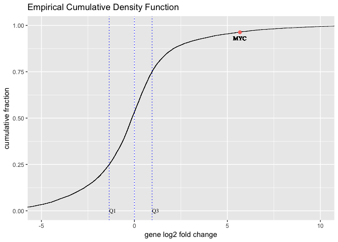

### Required R packages


```r
library(edgeR)
library(limma)
library(Glimma)
library(gplots)
library(ggplot2)
library(dplyr)
library(reshape)
options(width = 140)
library(ggrepel)
```

### Preparing Tumour Data


```r
seqdata_t <- read.delim("~/Documents/UMCCR/data/fpkm/featurecount_Unknown_B", stringsAsFactors = FALSE, comment.char = "#")
dim(seqdata_t)
```

```
## [1] 57905     8
```

```r
# New object that contains just the counts
countdata_t <- seqdata_t[,8, drop = FALSE]
head(countdata_t)
```

```
##   X.data.cephfs.punim0010.projects.Hofmann_WTS.Patients_WTS.merged.final.Unknown_B_RNA.Unknown_B_RNA.ready.bam
## 1                                                                                                            4
## 2                                                                                                          412
## 3                                                                                                            0
## 4                                                                                                            0
## 5                                                                                                            0
## 6                                                                                                            0
```

```r
dim(countdata_t) 
```

```
## [1] 57905     1
```

```r
# Add rownames i.e. GeneIDs to data
rownames(countdata_t) <- seqdata_t[,1]
head(countdata_t)
```

```
##                 X.data.cephfs.punim0010.projects.Hofmann_WTS.Patients_WTS.merged.final.Unknown_B_RNA.Unknown_B_RNA.ready.bam
## ENSG00000223972                                                                                                            4
## ENSG00000227232                                                                                                          412
## ENSG00000243485                                                                                                            0
## ENSG00000237613                                                                                                            0
## ENSG00000268020                                                                                                            0
## ENSG00000240361                                                                                                            0
```

```r
# Rename column heading for sample
colnames(countdata_t) <- c("Tumour")
head(countdata_t)
```

```
##                 Tumour
## ENSG00000223972      4
## ENSG00000227232    412
## ENSG00000243485      0
## ENSG00000237613      0
## ENSG00000268020      0
## ENSG00000240361      0
```

```r
# Filtering to remove low expressed genes. The cpm function also adds a small offset to avoid taking log of zero.
myCPM <- cpm(countdata_t)
head(myCPM)
```

```
##                     Tumour
## ENSG00000223972 0.05708918
## ENSG00000227232 5.88018506
## ENSG00000243485 0.00000000
## ENSG00000237613 0.00000000
## ENSG00000268020 0.00000000
## ENSG00000240361 0.00000000
```

```r
# Which values in myCPM are greater than 0.15?
thresh <- myCPM > 0.15

# This produces a logical matrix with TRUEs and FALSEs
head(thresh)
```

```
##                 Tumour
## ENSG00000223972  FALSE
## ENSG00000227232   TRUE
## ENSG00000243485  FALSE
## ENSG00000237613  FALSE
## ENSG00000268020  FALSE
## ENSG00000240361  FALSE
```

```r
# Summary of how many TRUEs there are in each row.
table(rowSums(thresh))
```

```
## 
##     0     1 
## 35106 22799
```

```r
# Would like to keep genes that have TRUE thresh value in each row of thresh
keep <- thresh == TRUE

# Subset the rows of countdata to keep the more highly expressed genes
counts_keep_t <- countdata_t[keep, ,  drop = FALSE]

# Converting row names to first coloumn
# counts_keep_t <- tibble::rownames_to_column(counts_keep_t, "gene_id")

# Taking a look at the subset data
summary(keep)
```

```
##    Tumour       
##  Mode :logical  
##  FALSE:35106    
##  TRUE :22799
```

```r
head(counts_keep_t)
```

```
##                 Tumour
## ENSG00000227232    412
## ENSG00000233750     18
## ENSG00000237683     87
## ENSG00000241860     83
## ENSG00000228463     72
## ENSG00000225630     14
```

```r
dim(counts_keep_t)
```

```
## [1] 22799     1
```

```r
str(counts_keep_t)
```

```
## 'data.frame':	22799 obs. of  1 variable:
##  $ Tumour: int  412 18 87 83 72 14 369 49 626 44 ...
```

```r
# Convert counts to DGEList object. First, create a DGEList object. This is an object used by edgeR to store count data. It has a number of slots for storing various parameters about the data.
y <- DGEList(counts_keep_t)

# have a look at y
y
```

```
## An object of class "DGEList"
## $counts
##                 Tumour
## ENSG00000227232    412
## ENSG00000233750     18
## ENSG00000237683     87
## ENSG00000241860     83
## ENSG00000228463     72
## 22794 more rows ...
## 
## $samples
##        group lib.size norm.factors
## Tumour     1 70027253            1
```

```r
# See what slots are stored in y
names(y)
```

```
## [1] "counts"  "samples"
```

```r
# Library size information is stored in the samples slot
y$samples
```

```
##        group lib.size norm.factors
## Tumour     1 70027253            1
```

```r
# Get log2 counts per million
logcounts_t <- cpm(y,log=TRUE)

# have a look at logcounts
head(logcounts_t)
```

```
##                      Tumour
## ENSG00000227232  2.55753108
## ENSG00000233750 -1.94002004
## ENSG00000237683  0.31723863
## ENSG00000241860  0.24953377
## ENSG00000228463  0.04508108
## ENSG00000225630 -2.29695459
```

```r
dim(logcounts_t)
```

```
## [1] 22799     1
```

### Preparing Normal Data


```r
# Downloaded pancreatic data from https://jhubiostatistics.shinyapps.io/recount/. Read in the data.
countdata <- read.delim("~/Documents/UMCCR/data/recount2/counts_gene_pan.tsv", stringsAsFactors = FALSE, comment.char = "#")
dim(countdata)
```

```
## [1] 58037     5
```

```r
head(countdata)
```

```
##   ERR674422 ERR674425 ERR674419 ERR674424         gene_id
## 1    351948    355222    428947    501887 ENSG00000000003
## 2      2517      2161       360       180 ENSG00000000005
## 3    101584     91970     82841    106308 ENSG00000000419
## 4     84722     89707     67709     79458 ENSG00000000457
## 5     80538     72318     86137    100940 ENSG00000000460
## 6     27827     22123       180       180 ENSG00000000938
```

```r
# Rearranging columns to have gene_id in a diff dataframe as that is not a numeric coloumn and the subsequent analysis assumes that the coloumns have numeric values. For now adding gene_ids as rownames.
countdata_n <- countdata[, c(1, 2, 3, 4)]
head(countdata_n)
```

```
##   ERR674422 ERR674425 ERR674419 ERR674424
## 1    351948    355222    428947    501887
## 2      2517      2161       360       180
## 3    101584     91970     82841    106308
## 4     84722     89707     67709     79458
## 5     80538     72318     86137    100940
## 6     27827     22123       180       180
```

```r
rownames(countdata_n) <- countdata[,5]

# Filtering to remove low expressed genes. The cpm function also adds a small offset to avoid taking log of zero.
myCPM <- cpm(countdata_n)

# Which values in myCPM are greater than 0.15?
thresh <- myCPM > 0.15

# This produces a logical matrix with TRUEs and FALSEs
head(thresh)
```

```
##                 ERR674422 ERR674425 ERR674419 ERR674424
## ENSG00000000003      TRUE      TRUE      TRUE      TRUE
## ENSG00000000005      TRUE      TRUE     FALSE     FALSE
## ENSG00000000419      TRUE      TRUE      TRUE      TRUE
## ENSG00000000457      TRUE      TRUE      TRUE      TRUE
## ENSG00000000460      TRUE      TRUE      TRUE      TRUE
## ENSG00000000938      TRUE      TRUE     FALSE     FALSE
```

```r
# Summary of how many TRUEs there are in each row.
table(rowSums(thresh))
```

```
## 
##     0     1     2     3     4 
## 28552  2196  3924  1461 21904
```

```r
# Would like to keep genes that have that have at least 2 TRUES in each row of thresh
keep <- rowSums(thresh) >= 2

# Subset the rows of countdata to keep the more highly expressed genes
counts_keep_n <- countdata_n[keep, ,  drop = FALSE]


# Taking a look at the subset data
summary(keep)
```

```
##    Mode   FALSE    TRUE 
## logical   30748   27289
```

```r
head(counts_keep_n)
```

```
##                 ERR674422 ERR674425 ERR674419 ERR674424
## ENSG00000000003    351948    355222    428947    501887
## ENSG00000000005      2517      2161       360       180
## ENSG00000000419    101584     91970     82841    106308
## ENSG00000000457     84722     89707     67709     79458
## ENSG00000000460     80538     72318     86137    100940
## ENSG00000000938     27827     22123       180       180
```

```r
dim(counts_keep_n)
```

```
## [1] 27289     4
```

```r
str(counts_keep_n)
```

```
## 'data.frame':	27289 obs. of  4 variables:
##  $ ERR674422: int  351948 2517 101584 84722 80538 27827 56047 163351 64079 314960 ...
##  $ ERR674425: int  355222 2161 91970 89707 72318 22123 53724 146982 70516 333703 ...
##  $ ERR674419: int  428947 360 82841 67709 86137 180 1800 189655 104874 221043 ...
##  $ ERR674424: int  501887 180 106308 79458 100940 180 900 210736 127157 259470 ...
```

```r
# Convert counts to DGEList object. First, create a DGEList object. This is an object used by edgeR to store count data. It has a number of slots for storing various parameters about the data.
y <- DGEList(counts_keep_n)

# have a look at y
y
```

```
## An object of class "DGEList"
## $counts
##                 ERR674422 ERR674425 ERR674419 ERR674424
## ENSG00000000003    351948    355222    428947    501887
## ENSG00000000005      2517      2161       360       180
## ENSG00000000419    101584     91970     82841    106308
## ENSG00000000457     84722     89707     67709     79458
## ENSG00000000460     80538     72318     86137    100940
## 27284 more rows ...
## 
## $samples
##           group   lib.size norm.factors
## ERR674422     1 3809336439            1
## ERR674425     1 3832627732            1
## ERR674419     1 3085980674            1
## ERR674424     1 3661108165            1
```

```r
# See what slots are stored in y
names(y)
```

```
## [1] "counts"  "samples"
```

```r
# Library size information is stored in the samples slot
y$samples
```

```
##           group   lib.size norm.factors
## ERR674422     1 3809336439            1
## ERR674425     1 3832627732            1
## ERR674419     1 3085980674            1
## ERR674424     1 3661108165            1
```

```r
# Get log2 counts per million
logcounts_n <- cpm(y,log=TRUE)

# have a look at logcounts
head(logcounts_n)
```

```
##                  ERR674422 ERR674425 ERR674419 ERR674424
## ENSG00000000003  6.5296799  6.534244  7.118927  7.098939
## ENSG00000000005 -0.5976828 -0.826457 -3.098801 -4.344174
## ENSG00000000419  4.7369934  4.584762  4.746548  4.859829
## ENSG00000000457  4.4751295  4.548819  4.455551  4.439845
## ENSG00000000460  4.4020628  4.237954  4.802836  4.785077
## ENSG00000000938  2.8688875  2.529159 -4.097942 -4.344174
```

```r
dim(logcounts_n)
```

```
## [1] 27289     4
```

### Comparing tumour sample VS panel of normals


```r
# Merging count data from tumour sample and normal samples. 
counts_merged <- merge(logcounts_n, logcounts_t, by="row.names")
dim(counts_merged)
```

```
## [1] 19019     6
```

```r
head(counts_merged)
```

```
##         Row.names ERR674422 ERR674425  ERR674419 ERR674424   Tumour
## 1 ENSG00000000003  6.529680  6.534244  7.1189273  7.098939 5.370624
## 2 ENSG00000000419  4.736993  4.584762  4.7465478  4.859829 5.111692
## 3 ENSG00000000457  4.475130  4.548819  4.4555512  4.439845 4.346142
## 4 ENSG00000000460  4.402063  4.237954  4.8028357  4.785077 4.514237
## 5 ENSG00000000938  2.868887  2.529159 -4.0979423 -4.344174 3.432875
## 6 ENSG00000000971  3.879032  3.809168 -0.7775602 -2.023876 9.347795
```

```r
rownames(counts_merged)= counts_merged$Row.names
counts_merged <- counts_merged[,2:6]

# Starting the actual analysis. Creating a design matrix first.
design <-  cbind(c(1,1,1,1,0), c(0,0,0,0,1))

# Assigning rownames and column names
rownames(design) <- c("C1", "C2", "C3", "C4", "T")
colnames(design) <- c("WT", "MU")

fit <- lmFit(counts_merged, design)
cont.matrix <- makeContrasts(MUvsWT=MU-WT, levels=design)
fit2 <- contrasts.fit(fit, cont.matrix)
fit2 <- eBayes(fit2)
result <- topTable(fit2, adjust="BH", number = Inf)
```


### Plotting result

1. ecdf


```r
#Preparing quartiles
q1 <- quantile(result$logFC)[2]
q2 <- 0
q3 <- quantile(result$logFC)[4]

#Making a tibble from quartiles
events <- data_frame(quartiles = c(q1,q2,q3),
                     text = c('Q1','','Q3'))

# Plot stat_ecdf for kallisto 
p <- ggplot(result, aes(result$logFC)) + 
  stat_ecdf(geom = "step", size = 0.25) + 
  geom_vline(data = events, aes(xintercept = events$quartiles), color = "blue", linetype="dotted") +
  geom_text(data = events, mapping = aes(label = events$text, y = 0, x = quartiles), family="Times", size = 3, hjust = 0) +
  geom_point(aes(x=result["ENSG00000136997", 1], y=0.963 , colour = "yellow"), show.legend = FALSE, label="MYC") +
  geom_text(aes(x=5.67, label="MYC", y=0.93), family="Times", size = 3) +
  coord_cartesian(xlim = c(-5, 10)) +
  labs(title="Empirical Cumulative Density Function", y = "cumulative fraction", x="gene log2 fold change", family="Times")
```

```
## Warning: Ignoring unknown parameters: label
```

```r
p
```

<!-- -->

### To do -> Fix mds plot and add z-transformation

2. mds


```r
sampleinfo <- data.frame(c('ERR674422','ERR674425','ERR674419', 'ERR674424', 'Tumour'), c('pancreatic', 'pancreatic', 'pancreatic', 'pancreatic', 'tumour'), c('normal', 'normal', 'normal', 'normal', 'tumour'))
colnames(sampleinfo) <-  c("SampleName", "CellType", "Status")
levels(sampleinfo$CellType)
col.cell <- c("purple","orange")[sampleinfo$CellType]
data.frame(sampleinfo$CellType,col.cell)

# Redo the MDS with cell type colouring
plotMDS(y,col=col.cell)
# Let's add a legend to the plot so we know which colours correspond to which cell type
legend("topleft",fill=c("purple","orange"),legend=levels(sampleinfo$CellType))
# Add a title
title("Cell type")
```


