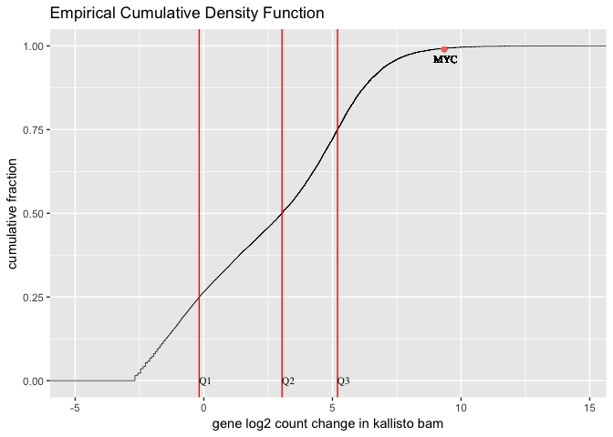
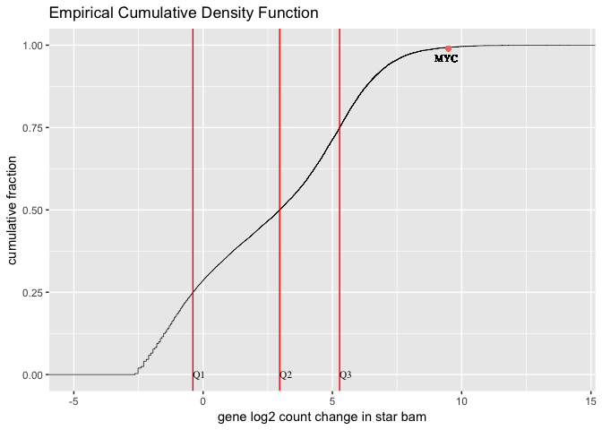

## Required R packages


```r
library(edgeR)
library(limma)
library(Glimma)
library(gplots)
library(ggplot2)
library(dplyr)
library(reshape)
options(width = 140)
library(ggrepel)
```

## Installation

Conda installed subread on spartan. It is available under `/home/sehrishk/.miniconda3/envs/subread/bin/`.

## Result on both bams

The command used to run featurecounts is:

```
/home/sehrishk/.miniconda3/envs/kall/bin/kallisto quant --genomebam --pseudobam --gtf /data/cephfs/punim0010/local/development/bcbio/genomes/Hsapi$
ns/GRCh37/rnaseq/ref-transcripts.gtf -o /data/cephfs/punim0010/projects/Kanwal_RNASeq_Testing/unknown_B_RNA -i /data/cephfs/punim0010/projects/Kanwal_RNASeq_Testing/seqc-test/rna-seq/work/kallisto/index/GRCh37/GRCh37.idx /data/cephfs/puni
m0010/projects/Hofmann_WTS/data/merged/Unknown_B_RNA_R1.fastq.gz /data/cephfs/punim0010/projects/Hofmann_WTS/data/merged/Unknown_B_RNA_R2.fastq.gz
```
### Console output

```
//========================== featureCounts setting ===========================\\
||                                                                            ||
||             Input files : 2 BAM files                                      ||
||                           P /data/cephfs/punim0010/projects/Kanwal_RNA ... ||
||                           P /data/cephfs/punim0010/projects/Hofmann_WT ... ||
||                                                                            ||
||             Output file : ./featurecount/featurecount_Unknown_B            ||
||                 Summary : ./featurecount/featurecount_Unknown_B.summary    ||
||              Annotation : /data/cephfs/punim0010/local/development/bcb ... ||
||      Dir for temp files : ./featurecount                                   ||
||                                                                            ||
||                 Threads : 1                                                ||
||                   Level : meta-feature level                               ||
||              Paired-end : no                                               ||
||         Strand specific : no                                               ||
||      Multimapping reads : not counted                                      ||
|| Multi-overlapping reads : not counted                                      ||
||   Min overlapping bases : 1                                                ||
||                                                                            ||
\\===================== http://subread.sourceforge.net/ ======================//

//================================= Running ==================================\\
||                                                                            ||
|| Load annotation file /data/cephfs/punim0010/local/development/bcbio/ge ... ||
||    Features : 1195764                                                      ||
||    Meta-features : 57905                                                   ||
||    Chromosomes/contigs : 61                                                ||
||                                                                            ||
|| Process BAM file /data/cephfs/punim0010/projects/Kanwal_RNASeq_Testing ... ||
||    Paired-end reads are included.                                          ||
||    Assign reads to features...                                             ||
||    Total reads : 108613106                                                 ||
||    Successfully assigned reads : 79414232 (73.1%)                          ||
||    Running time : 4.05 minutes                                             ||
||                                                                            ||
|| Process BAM file /data/cephfs/punim0010/projects/Hofmann_WTS/Patients_ ... ||
||    Paired-end reads are included.                                          ||
||    Assign reads to features...                                             ||
||    Total reads : 109022810                                                 ||
||    Successfully assigned reads : 70065822 (64.3%)                          ||
||    Running time : 4.40 minutes                                             ||
||                                                                            ||
||                         Read assignment finished.                          ||
||                                                                            ||
|| Summary of counting results can be found in file "./featurecount/featurec  ||
|| ount_Unknown_B.summary"                                                    ||
||                                                                            ||
\\===================== http://subread.sourceforge.net/ ======================//
```

The final result `featurecount_Unknown_B` is available on spartan under `/data/cephfs/punim0010/projects/Kanwal_RNASeq_Testing/unknown_B_RNA/featurecount`.

### Summary of featurecounts command

```
Status  kallisto.bam        star.bam
Assigned        79414232        70065822
Unassigned_Unmapped     23066004        6903665
Unassigned_MappingQuality       0       0
Unassigned_Chimera      0       0
Unassigned_FragmentLength       0       0
Unassigned_Duplicate    0       0
Unassigned_MultiMapping 0       11321849
Unassigned_Secondary    0       0
Unassigned_Nonjunction  0       0
Unassigned_NoFeatures   0       14855590
Unassigned_Overlapping_Length   0       0
Unassigned_Ambiguity    6132870 5875884
```

## Analysis


```r
seqdata <- read.delim("~/Documents/UMCCR/data/fpkm/featurecount_Unknown_B", stringsAsFactors = FALSE, comment.char = "#")
dim(seqdata)
```

```
## [1] 57905     8
```

Create a new data object that contains just the counts.


```r
countdata <- seqdata[,7:8, drop = FALSE]
head(countdata)
```

```
##   X.data.cephfs.punim0010.projects.Kanwal_RNASeq_Testing.unknown_B_RNA.kallisto.bam
## 1                                                                                37
## 2                                                                              1040
## 3                                                                                 0
## 4                                                                                84
## 5                                                                                14
## 6                                                                                 0
##   X.data.cephfs.punim0010.projects.Hofmann_WTS.Patients_WTS.merged.final.Unknown_B_RNA.Unknown_B_RNA.ready.bam
## 1                                                                                                            4
## 2                                                                                                          412
## 3                                                                                                            0
## 4                                                                                                            0
## 5                                                                                                            0
## 6                                                                                                            0
```

```r
dim(countdata) 
```

```
## [1] 57905     2
```


Add rownames i.e. GeneIDs to data


```r
rownames(countdata) <- seqdata[,1]
head(countdata)
```

```
##                 X.data.cephfs.punim0010.projects.Kanwal_RNASeq_Testing.unknown_B_RNA.kallisto.bam
## ENSG00000223972                                                                                37
## ENSG00000227232                                                                              1040
## ENSG00000243485                                                                                 0
## ENSG00000237613                                                                                84
## ENSG00000268020                                                                                14
## ENSG00000240361                                                                                 0
##                 X.data.cephfs.punim0010.projects.Hofmann_WTS.Patients_WTS.merged.final.Unknown_B_RNA.Unknown_B_RNA.ready.bam
## ENSG00000223972                                                                                                            4
## ENSG00000227232                                                                                                          412
## ENSG00000243485                                                                                                            0
## ENSG00000237613                                                                                                            0
## ENSG00000268020                                                                                                            0
## ENSG00000240361                                                                                                            0
```

```r
# Taking a look at column names to know the sample names

colnames(countdata)
```

```
## [1] "X.data.cephfs.punim0010.projects.Kanwal_RNASeq_Testing.unknown_B_RNA.kallisto.bam"                           
## [2] "X.data.cephfs.punim0010.projects.Hofmann_WTS.Patients_WTS.merged.final.Unknown_B_RNA.Unknown_B_RNA.ready.bam"
```

```r
#Renames sample name to a meaningful title

colnames(countdata) <- c("kallisto.bam", "star.bam")
head(countdata)
```

```
##                 kallisto.bam star.bam
## ENSG00000223972           37        4
## ENSG00000227232         1040      412
## ENSG00000243485            0        0
## ENSG00000237613           84        0
## ENSG00000268020           14        0
## ENSG00000240361            0        0
```


### Filtering to remove lowly expressed genes

Genes with very low counts across all libraries provide little evidence for differential expression and they interfere with some of the statistical approximations.


```r
myCPM <- cpm(countdata)
head(myCPM)
```

```
##                 kallisto.bam   star.bam
## ENSG00000223972    0.4659115 0.05708918
## ENSG00000227232   13.0958894 5.88018506
## ENSG00000243485    0.0000000 0.00000000
## ENSG00000237613    1.0577449 0.00000000
## ENSG00000268020    0.1762908 0.00000000
## ENSG00000240361    0.0000000 0.00000000
```

```r
# Which values in myCPM are greater than 0.25?
thresh <- myCPM > 0.15

# This produces a logical matrix with TRUEs and FALSEs
head(thresh)
```

```
##                 kallisto.bam star.bam
## ENSG00000223972         TRUE    FALSE
## ENSG00000227232         TRUE     TRUE
## ENSG00000243485        FALSE    FALSE
## ENSG00000237613         TRUE    FALSE
## ENSG00000268020         TRUE    FALSE
## ENSG00000240361        FALSE    FALSE
```

```r
# Summary of how many TRUEs there are in each row
# There are 18128 genes (out of 57905) that have TRUEs in both bams.
table(rowSums(thresh))
```

```
## 
##     0     1     2 
## 31726  4665 21514
```

```r
# Would like to keep genes that have TRUE thresh value for both bams in each row of thresh
keep <- rowSums(thresh) == 2

# Subset the rows of countdata to keep the more highly expressed genes
counts_keep <- countdata[keep, ,  drop = FALSE]

# Taking a look at the subset data
summary(keep)
```

```
##    Mode   FALSE    TRUE 
## logical   36391   21514
```

```r
head(counts_keep)
```

```
##                 kallisto.bam star.bam
## ENSG00000227232         1040      412
## ENSG00000233750          388       18
## ENSG00000237683          279       87
## ENSG00000241860         1273       83
## ENSG00000228463          298       72
## ENSG00000225630          669       14
```

```r
dim(counts_keep)
```

```
## [1] 21514     2
```

```r
str(counts_keep)
```

```
## 'data.frame':	21514 obs. of  2 variables:
##  $ kallisto.bam: int  1040 388 279 1273 298 669 19454 476 264 58 ...
##  $ star.bam    : int  412 18 87 83 72 14 369 626 44 14 ...
```

A CPM of 0.15 is used as it corresponds to a count of 10-15 for the library sizes in this data set. If the count is any smaller, it is considered to be very low, indicating that the associated gene is not expressed in that sample. As a general rule, a good threshold can be chosen by identifying the CPM that corresponds to a count of 10, which in this case is about 0.15. It is important to filter with CPMs rather than filtering on the counts directly, as the latter does not account for differences in library sizes between samples.


```r
# Let's have a look and see whether threshold of 0.25 does indeed correspond to a count of about 10-15 in 1st sample (star bam)

plot(myCPM[,1],countdata[,1])
```

<!-- -->

```r
# Limit the x and y-axis so we can actually look to see what is happening at the smaller counts

plot(myCPM[,1],countdata[,1],ylim=c(0,50),xlim=c(0,3))

# Add a vertical line at 0.25 CPM and horizontal at ~10
abline(v = 0.15, h = 10, col=c("blue", "red"))
```

<!-- -->

```r
# Let's have a look and see whether threshold of 0.25 does indeed correspond to a count of about 10-15 in 2nd sample (kallisto bam)

plot(myCPM[,2],countdata[,2])
```

<!-- -->

```r
# Limit the x and y-axis so we can actually look to see what is happening at the smaller counts

plot(myCPM[,2],countdata[,2],ylim=c(0,50),xlim=c(0,2))

# Add a vertical line at 0.25 CPM and horizontal at ~10
abline(v = 0.15, h = 10, col=c("blue", "red"))
```

<!-- -->

## Distribution Plot

Count data is not normally distributed, so if we want to examine the distributions of the raw counts we need to log the counts. Next we’ll use box plots to check the distribution of the read counts on the log2 scale. We can use the cpm function to get log2 counts per million, which are corrected for the different library sizes. The cpm function also adds a small offset to avoid taking log of zero.


```r
# First, create a DGEList object. This is an object used by edgeR to store count data. It has a number of slots for storing various parameters about the data.
y <- DGEList(counts_keep)

# have a look at y
y
```

```
## An object of class "DGEList"
## $counts
##                 kallisto.bam star.bam
## ENSG00000227232         1040      412
## ENSG00000233750          388       18
## ENSG00000237683          279       87
## ENSG00000241860         1273       83
## ENSG00000228463          298       72
## 21509 more rows ...
## 
## $samples
##              group lib.size norm.factors
## kallisto.bam     1 78443615            1
## star.bam         1 69993554            1
```

```r
# See what slots are stored in y
names(y)
```

```
## [1] "counts"  "samples"
```

```r
# Library size information is stored in the samples slot
y$samples
```

```
##              group lib.size norm.factors
## kallisto.bam     1 78443615            1
## star.bam         1 69993554            1
```

```r
# Get log2 counts per million
logcounts <- cpm(y,log=TRUE)

# have a look at logcounts
head(logcounts)
```

```
##                 kallisto.bam    star.bam
## ENSG00000227232     3.729150  2.55817571
## ENSG00000233750     2.307311 -1.94045109
## ENSG00000237683     1.831903  0.31769771
## ENSG00000241860     4.020732  0.24998155
## ENSG00000228463     1.926863  0.04549131
## ENSG00000225630     3.092848 -2.29770172
```

```r
dim(logcounts)
```

```
## [1] 21514     2
```

```r
# Check distributions of samples using boxplots
boxplot(logcounts, xlab="", ylab="Log2 counts per million",las=2)

# Let's add a blue horizontal line that corresponds to the median logCPM
abline(h=median(logcounts),col="blue")
title("Boxplots of logCPMs (unnormalised)")
```

<!-- -->

## Plotting cumulative fraction VS gene log2 fold change using Empirical Cumulative Density Function (ecdf)


```r
df <- as.data.frame(logcounts)

# Plot stat_ecdf for both kallisto and star bam on the same plot
dff <- data.frame(x = c(df$kallisto.bam, df$star.bam), g = gl(2, 21514, labels = c("kallisto", "star")))

p <- ggplot(dff, aes(x, colour = g)) + 
  stat_ecdf(geom = "step") +
  labs(title="Empirical Cumulative Density Function", y = "cumulative fraction", x="gene log2 fold change in bams") +
  geom_vline(xintercept = 0, linetype="dotted", color = "blue")

p <- p + expand_limits(x = -5, y = 0)
p
```

<!-- -->

## Adding Quartiles and MYC for kallisto bam


```r
df <- as.data.frame(logcounts)

#Preparing quartiles
q1 <- quantile(df$kallisto.bam)[2]
q2 <- quantile(df$kallisto.bam)[3]
q3 <- quantile(df$kallisto.bam)[4]

# Plot stat_ecdf for kallisto 
p <- ggplot(df, aes(df$kallisto.bam)) + 
  stat_ecdf(geom = "step", size = 0.25) +
  geom_vline(xintercept = q1, linetype="dotted", color = "red") +
  geom_text(aes(x=q1, label="Q1", y=0), family="Times", size = 3) +
  geom_vline(xintercept = q2, linetype="dotted", color = "red") +
  geom_text(aes(x=q2, label="Q2", y=0), family="Times", size = 3) +
  geom_vline(xintercept = q3, linetype="dotted", color = "red") +
  geom_text(aes(x=q3, label="Q3", y=0), family="Times", size = 3) +
  geom_point(aes(x=df["ENSG00000136997", 1], y=0.99 , colour = "yellow"), show.legend = FALSE, label="MYC") +
  geom_text(aes(x=9.4, label="MYC", y=0.96), family="Times", size = 3) +
  labs(title="Empirical Cumulative Density Function", y = "cumulative fraction", x="gene log2 fold change in kallisto bam")
```

```
## Warning: Ignoring unknown parameters: label
```

```r
p <- p + expand_limits(x = -5, y = 0)
p
```

<!-- -->

## Adding Quartiles information and MYC for star bam


```r
#Preparing quartiles
q1 <- quantile(df$star.bam)[2]
q2 <- quantile(df$star.bam)[3]
q3 <- quantile(df$star.bam)[4]

# Plot stat_ecdf for kallisto 
p <- ggplot(df, aes(df$star.bam)) +
  stat_ecdf(geom = "step", size = 0.25) + 
  geom_vline(xintercept = q1, linetype="dotted", color = "red") +
  geom_text(aes(x=q1, label="Q1", y=0), family="Times", size = 3) +
  geom_vline(xintercept = q2, linetype="dotted", color = "red") +
  geom_text(aes(x=q2, label="Q2", y=0), family="Times", size = 3) +
  geom_vline(xintercept = q3, linetype="dotted", color = "red") +
  geom_text(aes(x=q3, label="Q3", y=0), family="Times", size = 3) +
  geom_point(aes(x=df["ENSG00000136997", 2], y=0.99 , colour = "yellow"), show.legend = FALSE, label="MYC") +
  geom_text(aes(x=9.4, label="MYC", y=0.96), family="Times", size = 3) +
  labs(title="Empirical Cumulative Density Function", y = "cumulative fraction", x="gene log2 fold change in star bam")
```

```
## Warning: Ignoring unknown parameters: label
```

```r
p <- p + expand_limits(x = -5, y = 0)
p
```

<!-- -->
