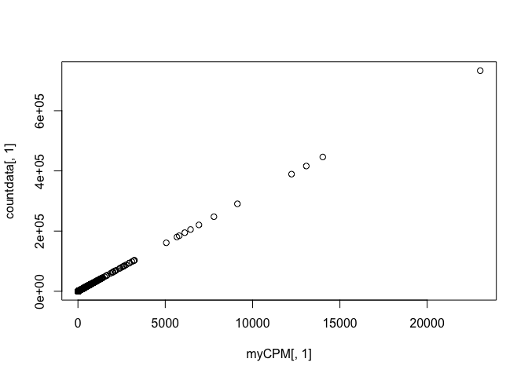
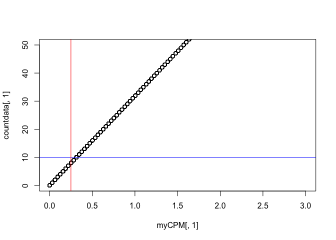
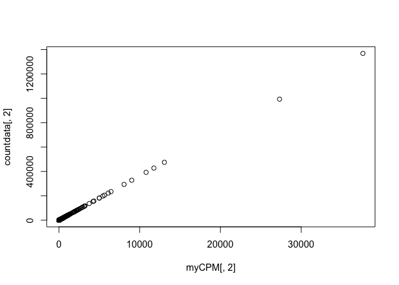
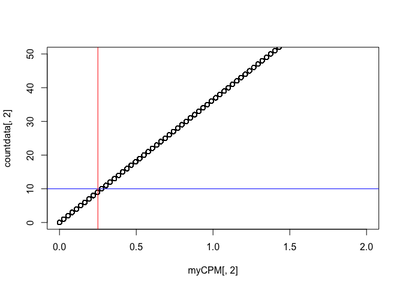
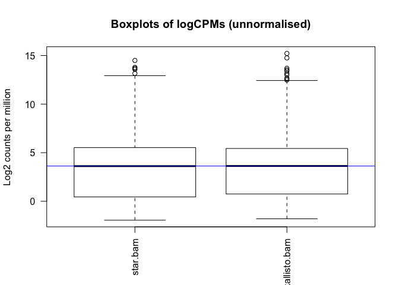

This report documents the results of using `subread featureCounts` on star and kallisto bam files, followed by the analysis.

## Required R packages


```r
library(edgeR)
```

```
## Loading required package: limma
```

```r
library(limma)
library(Glimma)
library(gplots)
```

```
## 
## Attaching package: 'gplots'
```

```
## The following object is masked from 'package:stats':
## 
##     lowess
```

```r
library(dplyr)
```

```
## 
## Attaching package: 'dplyr'
```

```
## The following objects are masked from 'package:stats':
## 
##     filter, lag
```

```
## The following objects are masked from 'package:base':
## 
##     intersect, setdiff, setequal, union
```

```r
#library(org.Mm.eg.db)
#library(RColorBrewer)
options(width = 140)
```

## Installation

Conda installed subread on spartan. It is available under `/home/sehrishk/.miniconda3/envs/subread/bin/`.

## Result on both bams

The command used to run featurecounts is:

```
/home/sehrishk/.miniconda3/envs/subread/bin/featureCounts -a /data/cephfs/punim0010/local/development/bcbio/genomes/Hsapiens/GRCh37/rnaseq/ref-transcripts.gtf -o ./featurecount/featurecount_star_kallisto /data/cephfs/punim0010/projects/Kanwal_RNASeq_Testing/seqc-test/rna-seq/work/align/RNA-Test-kallisto/RNA-Test-kallisto_star/RNA-Test-kallisto.bam /data/cephfs/punim0010/projects/Kanwal_RNASeq_Testing/seqc-test/rna-seq/work/kallisto/RNA-Test-kallisto/pseudoalignment/pseudoalignments.sorted.bam
```
### Console output

```
//========================== featureCounts setting ===========================\\
||                                                                            ||
||             Input files : 2 BAM files                                      ||
||                           P /data/cephfs/punim0010/projects/Kanwal_RNA ... ||
||                           P /data/cephfs/punim0010/projects/Kanwal_RNA ... ||
||                                                                            ||
||             Output file : ./featurecount/featurecount_star_kallisto        ||
||                 Summary : ./featurecount/featurecount_star_kallisto.su ... ||
||              Annotation : /data/cephfs/punim0010/local/development/bcb ... ||
||      Dir for temp files : ./featurecount                                   ||
||                                                                            ||
||                 Threads : 1                                                ||
||                   Level : meta-feature level                               ||
||              Paired-end : no                                               ||
||         Strand specific : no                                               ||
||      Multimapping reads : not counted                                      ||
|| Multi-overlapping reads : not counted                                      ||
||   Min overlapping bases : 1                                                ||
||                                                                            ||
\\===================== http://subread.sourceforge.net/ ======================//

//================================= Running ==================================\\
||                                                                            ||
|| Load annotation file /data/cephfs/punim0010/local/development/bcbio/ge ... ||
||    Features : 1195764                                                      ||
||    Meta-features : 57905                                                   ||
||    Chromosomes/contigs : 61                                                ||
||                                                                            ||
|| Process BAM file /data/cephfs/punim0010/projects/Kanwal_RNASeq_Testing ... ||
||    Paired-end reads are included.                                          ||
||    Assign reads to features...                                             ||
||    Total reads : 48967081                                                  ||
||    Successfully assigned reads : 31823509 (65.0%)                          ||
||    Running time : 2.10 minutes                                             ||
||                                                                            ||
|| Process BAM file /data/cephfs/punim0010/projects/Kanwal_RNASeq_Testing ... ||
||    Paired-end reads are included.                                          ||
||    Assign reads to features...                                             ||
||    Total reads : 49077810                                                  ||
||    Successfully assigned reads : 36358105 (74.1%)                          ||
||    Running time : 1.89 minutes                                             ||
||                                                                            ||
||                         Read assignment finished.                          ||
||                                                                            ||
|| Summary of counting results can be found in file "./featurecount/featurec  ||

▽
|| ount_star_kallisto.summary"                                                ||
||                                                                            ||
\\===================== http://subread.sourceforge.net/ ======================//

```

The final result `featurecount_star_kallisto` is available on spartan under `/data/cephfs/punim0010/projects/Kanwal_RNASeq_Testing/featurecount`.

### Summary of featurecounts command

```
Status  star.bam       kallisto.bam
Assigned        31823509        36358105
Unassigned_Unmapped     735375  10249262
Unassigned_MappingQuality       0       0
Unassigned_Chimera      0       0
Unassigned_FragmentLength       0       0
Unassigned_Duplicate    0       0
Unassigned_MultiMapping 5290398 0
Unassigned_Secondary    0       0
Unassigned_Nonjunction  0       0
Unassigned_NoFeatures   8821272 0
Unassigned_Overlapping_Length   0       0
Unassigned_Ambiguity    2296527 2470443
```

## Analysis


```r
seqdata <- read.delim("~/Documents/UMCCR/data/fpkm/featurecount_star_kallisto", stringsAsFactors = FALSE, comment.char = "#")
dim(seqdata)
```

```
## [1] 57905     8
```

Create a new data object that contains just the counts.


```r
countdata <- seqdata[,7:8, drop = FALSE]
head(countdata)
```

```
##   star.bam kallisto.bam
## 1        4           62
## 2      169          550
## 3        0            0
## 4        0           23
## 5        0            5
## 6        0            0
```

```r
dim(countdata) 
```

```
## [1] 57905     2
```


Add rownames i.e. GeneIDs to data


```r
rownames(countdata) <- seqdata[,1]
head(countdata)
```

```
##                 star.bam kallisto.bam
## ENSG00000223972        4           62
## ENSG00000227232      169          550
## ENSG00000243485        0            0
## ENSG00000237613        0           23
## ENSG00000268020        0            5
## ENSG00000240361        0            0
```

```r
# Taking a look at column names to know the sample names

colnames(countdata)
```

```
## [1] "star.bam"     "kallisto.bam"
```

```r
#Renames sample name to a meaningful title

# colnames(countdata) <- "kallisto_bam"
# head(countdata)
```


### Filtering to remove lowly expressed genes

Genes with very low counts across all libraries provide little evidence for differential expression and they interfere with some of the statistical approximations.


```r
myCPM <- cpm(countdata)
head(myCPM)
```

```
##                  star.bam kallisto.bam
## ENSG00000223972 0.1256932    1.7052594
## ENSG00000227232 5.3105395   15.1273011
## ENSG00000243485 0.0000000    0.0000000
## ENSG00000237613 0.0000000    0.6325962
## ENSG00000268020 0.0000000    0.1375209
## ENSG00000240361 0.0000000    0.0000000
```

```r
# Which values in myCPM are greater than 0.25?
thresh <- myCPM > 0.25

# This produces a logical matrix with TRUEs and FALSEs
head(thresh)
```

```
##                 star.bam kallisto.bam
## ENSG00000223972    FALSE         TRUE
## ENSG00000227232     TRUE         TRUE
## ENSG00000243485    FALSE        FALSE
## ENSG00000237613    FALSE         TRUE
## ENSG00000268020    FALSE        FALSE
## ENSG00000240361    FALSE        FALSE
```

```r
# Summary of how many TRUEs there are in each row
# There are 18128 genes (out of 57905) that have TRUEs in both bams.
table(rowSums(thresh))
```

```
## 
##     0     1     2 
## 34739  5038 18128
```

```r
# Would like to keep genes that have TRUE thresh value for both bams in each row of thresh
keep <- rowSums(thresh) == 2

# Subset the rows of countdata to keep the more highly expressed genes
counts_keep <- countdata[keep, ,  drop = FALSE]

# Taking a look at the subset data
summary(keep)
```

```
##    Mode   FALSE    TRUE 
## logical   39777   18128
```

```r
head(counts_keep)
```

```
##                 star.bam kallisto.bam
## ENSG00000227232      169          550
## ENSG00000241860       11          396
## ENSG00000228463       16          108
## ENSG00000237973      362        20505
## ENSG00000229344       16          226
## ENSG00000248527     1044          855
```

```r
dim(counts_keep)
```

```
## [1] 18128     2
```

```r
str(counts_keep)
```

```
## 'data.frame':	18128 obs. of  2 variables:
##  $ star.bam    : int  169 11 16 362 16 1044 27 25 48 13 ...
##  $ kallisto.bam: int  550 396 108 20505 226 855 548 112 188 13 ...
```

A CPM of 0.25 is used as it corresponds to a count of 10-15 for the library sizes in this data set. If the count is any smaller, it is considered to be very low, indicating that the associated gene is not expressed in that sample. As a general rule, a good threshold can be chosen by identifying the CPM that corresponds to a count of 10, which in this case is about 0.25. It is important to filter with CPMs rather than filtering on the counts directly, as the latter does not account for differences in library sizes between samples.

However, it should be noted that the graph for kallisto bam is not as linear and clean as star bam, which indicates  


```r
# Let's have a look and see whether threshold of 0.25 does indeed correspond to a count of about 10-15 in 1st sample (star bam)

plot(myCPM[,1],countdata[,1])
```

<!-- -->

```r
# Limit the x and y-axis so we can actually look to see what is happening at the smaller counts

plot(myCPM[,1],countdata[,1],ylim=c(0,50),xlim=c(0,3))

# Add a vertical line at 0.25 CPM and horizontal at ~10
abline(v = 0.25, h = 10, col=c("blue", "red"))
```

<!-- -->

```r
# Let's have a look and see whether threshold of 0.25 does indeed correspond to a count of about 10-15 in 2nd sample (kallisto bam)

plot(myCPM[,2],countdata[,2])
```

<!-- -->

```r
# Limit the x and y-axis so we can actually look to see what is happening at the smaller counts

plot(myCPM[,2],countdata[,2],ylim=c(0,50),xlim=c(0,2))

# Add a vertical line at 0.25 CPM and horizontal at ~10
abline(v = 0.25, h = 10, col=c("blue", "red"))
```

<!-- -->

## Distribution Plot

Count data is not normally distributed, so if we want to examine the distributions of the raw counts we need to log the counts. Next we’ll use box plots to check the distribution of the read counts on the log2 scale. We can use the cpm function to get log2 counts per million, which are corrected for the different library sizes. The cpm function also adds a small offset to avoid taking log of zero.


```r
# First, create a DGEList object. This is an object used by edgeR to store count data. It has a number of slots for storing various parameters about the data.
y <- DGEList(counts_keep)

# have a look at y
y
```

```
## An object of class "DGEList"
## $counts
##                 star.bam kallisto.bam
## ENSG00000227232      169          550
## ENSG00000241860       11          396
## ENSG00000228463       16          108
## ENSG00000237973      362        20505
## ENSG00000229344       16          226
## 18123 more rows ...
## 
## $samples
##              group lib.size norm.factors
## star.bam         1 31777469            1
## kallisto.bam     1 35898783            1
```

```r
# See what slots are stored in y
names(y)
```

```
## [1] "counts"  "samples"
```

```r
# Library size information is stored in the samples slot
y$samples
```

```
##              group lib.size norm.factors
## star.bam         1 31777469            1
## kallisto.bam     1 35898783            1
```

```r
# Get log2 counts per million
logcounts <- cpm(y,log=TRUE)

# have a look at logcounts
head(logcounts)
```

```
##                   star.bam kallisto.bam
## ENSG00000227232  2.4129499     3.938120
## ENSG00000241860 -1.5000329     3.464460
## ENSG00000228463 -0.9689168     1.592563
## ENSG00000237973  3.5108489     9.157844
## ENSG00000229344 -0.9689168     2.656008
## ENSG00000248527  5.0382981     4.574365
```

```r
dim(logcounts)
```

```
## [1] 18128     2
```

```r
# Check distributions of samples using boxplots
boxplot(logcounts, xlab="", ylab="Log2 counts per million",las=2)

# Let's add a blue horizontal line that corresponds to the median logCPM
abline(h=median(logcounts),col="blue")
title("Boxplots of logCPMs (unnormalised)")
```

<!-- -->


