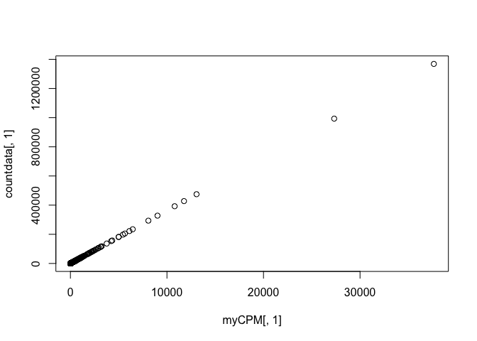
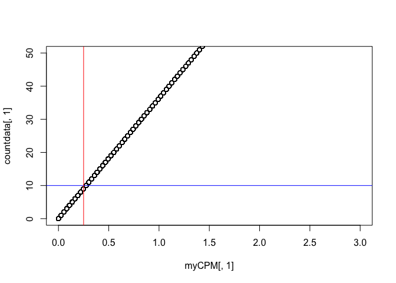

This report documents the results of using `subread featureCounts` on star and kallisto bam file, followed by the analysis.

## Required R packages


```r
library(edgeR)
```

```
## Loading required package: limma
```

```r
library(limma)
library(Glimma)
library(gplots)
```

```
## 
## Attaching package: 'gplots'
```

```
## The following object is masked from 'package:stats':
## 
##     lowess
```

```r
#library(org.Mm.eg.db)
#library(RColorBrewer)
options(width = 140)
```

## Installation

Conda installed subread on spartan. It is available under `/home/sehrishk/.miniconda3/envs/subread/bin/`.

## Results on star bam

```
/home/sehrishk/.miniconda3/envs/subread/bin/featureCounts -a /data/cephfs/punim0010/local/development/bcbio/genomes/Hsapiens/GRCh37/rnaseq/ref-transcripts.gtf -o ./featurecount/star /data/cephfs/punim0010/projects/Kanwal_RNASeq_Testing/seqc-test/rna-seq/work/align/RNA-Test-kallisto/RNA-Test-kallisto_star/RNA-Test-kallisto.bam
```

```
//========================== featureCounts setting ===========================\\
||                                                                            ||
||             Input files : 1 BAM file                                       ||
||                           P /data/cephfs/punim0010/projects/Kanwal_RNA ... ||
||                                                                            ||
||             Output file : ./featurecount/star                              ||
||                 Summary : ./featurecount/star.summary                      ||
||              Annotation : /data/cephfs/punim0010/local/development/bcb ... ||
||      Dir for temp files : ./featurecount                                   ||
||                                                                            ||
||                 Threads : 1                                                ||
||                   Level : meta-feature level                               ||
||              Paired-end : no                                               ||
||         Strand specific : no                                               ||
||      Multimapping reads : not counted                                      ||
|| Multi-overlapping reads : not counted                                      ||
||   Min overlapping bases : 1                                                ||
||                                                                            ||
\\===================== http://subread.sourceforge.net/ ======================//

//================================= Running ==================================\\
||                                                                            ||
|| Load annotation file /data/cephfs/punim0010/local/development/bcbio/ge ... ||
||    Features : 1195764                                                      ||
||    Meta-features : 57905                                                   ||
||    Chromosomes/contigs : 61                                                ||
||                                                                            ||
|| Process BAM file /data/cephfs/punim0010/projects/Kanwal_RNASeq_Testing ... ||
||    Paired-end reads are included.                                          ||
||    Assign reads to features...                                             ||
||    Total reads : 48967081                                                  ||
||    Successfully assigned reads : 31823509 (65.0%)                          ||
||    Running time : 2.09 minutes                                             ||
||                                                                            ||
||                         Read assignment finished.                          ||
||                                                                            ||
|| Summary of counting results can be found in file "./featurecount/star.sum  ||
|| mary"                                                                      ||
||                                                                            ||
\\===================== http://subread.sourceforge.net/ ======================//
```

## Results on kallisto bam

```
/home/sehrishk/.miniconda3/envs/subread/bin/featureCounts -a /data/cephfs/punim0010/local/development/bcbio/genomes/Hsapiens/GRCh37/rnaseq/ref-transcripts.gtf -o ./featurecount/kallisto /data/cephfs/punim0010/projects/Kanwal_RNASeq_Testing/seqc-test/rna-seq/work/kallisto/RNA-Test-kallisto/pseudoalignment/pseudoalignments.sorted.bam
```

```
//========================== featureCounts setting ===========================\\
||                                                                            ||
||             Input files : 1 BAM file                                       ||
||                           P /data/cephfs/punim0010/projects/Kanwal_RNA ... ||
||                                                                            ||
||             Output file : ./featurecount/kallisto                          ||
||                 Summary : ./featurecount/kallisto.summary                  ||
||              Annotation : /data/cephfs/punim0010/local/development/bcb ... ||
||      Dir for temp files : ./featurecount                                   ||
||                                                                            ||
||                 Threads : 1                                                ||
||                   Level : meta-feature level                               ||
||              Paired-end : no                                               ||
||         Strand specific : no                                               ||
||      Multimapping reads : not counted                                      ||
|| Multi-overlapping reads : not counted                                      ||
||   Min overlapping bases : 1                                                ||
||                                                                            ||
\\===================== http://subread.sourceforge.net/ ======================//

//================================= Running ==================================\\
||                                                                            ||
|| Load annotation file /data/cephfs/punim0010/local/development/bcbio/ge ... ||
||    Features : 1195764                                                      ||
||    Meta-features : 57905                                                   ||
||    Chromosomes/contigs : 61                                                ||
||                                                                            ||
|| Process BAM file /data/cephfs/punim0010/projects/Kanwal_RNASeq_Testing ... ||
||    Paired-end reads are included.                                          ||
||    Assign reads to features...                                             ||
||    Total reads : 49077810                                                  ||
||    Successfully assigned reads : 36358105 (74.1%)                          ||
||    Running time : 1.89 minutes                                             ||
||                                                                            ||
||                         Read assignment finished.                          ||
||                                                                            ||
|| Summary of counting results can be found in file "./featurecount/kallisto  ||
|| .summary"                                                                  ||
||                                                                            ||
\\===================== http://subread.sourceforge.net/ ======================//
```

## Analysis


```r
seqdata_kallisto <- read.delim("./kallisto.txt", stringsAsFactors = FALSE, comment.char = "#")
dim(seqdata_kallisto)
```

```
## [1] 57905     7
```

Create a new data object that contains just the counts.


```r
countdata <- seqdata_kallisto[,7, drop = FALSE]
head(countdata)
```

```
##   X.data.cephfs.punim0010.projects.Kanwal_RNASeq_Testing.seqc.test.rna.seq.work.kallisto.RNA.Test.kallisto.pseudoalignment.pseudoalignments.sorted.bam
## 1                                                                                                                                                   62
## 2                                                                                                                                                  550
## 3                                                                                                                                                    0
## 4                                                                                                                                                   23
## 5                                                                                                                                                    5
## 6                                                                                                                                                    0
```

```r
dim(countdata)
```

```
## [1] 57905     1
```


Add rownames i.e. GeneIDs to data


```r
rownames(countdata) <- seqdata_kallisto[,1]
head(countdata)
```

```
##                 X.data.cephfs.punim0010.projects.Kanwal_RNASeq_Testing.seqc.test.rna.seq.work.kallisto.RNA.Test.kallisto.pseudoalignment.pseudoalignments.sorted.bam
## ENSG00000223972                                                                                                                                                   62
## ENSG00000227232                                                                                                                                                  550
## ENSG00000243485                                                                                                                                                    0
## ENSG00000237613                                                                                                                                                   23
## ENSG00000268020                                                                                                                                                    5
## ENSG00000240361                                                                                                                                                    0
```

```r
# Taking a look at column names to know the sample names

colnames(countdata)
```

```
## [1] "X.data.cephfs.punim0010.projects.Kanwal_RNASeq_Testing.seqc.test.rna.seq.work.kallisto.RNA.Test.kallisto.pseudoalignment.pseudoalignments.sorted.bam"
```

```r
#Renames sample name to a meaningful title

colnames(countdata) <- "kallisto_bam"
head(countdata)
```

```
##                 kallisto_bam
## ENSG00000223972           62
## ENSG00000227232          550
## ENSG00000243485            0
## ENSG00000237613           23
## ENSG00000268020            5
## ENSG00000240361            0
```


### Filtering to remove lowly expressed genes

Genes with very low counts across all libraries provide little evidence for differential expression and they interfere with some of the statistical approximations.


```r
myCPM <- cpm(countdata)
head(myCPM)
```

```
##                 kallisto_bam
## ENSG00000223972    1.7052594
## ENSG00000227232   15.1273011
## ENSG00000243485    0.0000000
## ENSG00000237613    0.6325962
## ENSG00000268020    0.1375209
## ENSG00000240361    0.0000000
```

```r
# Which values in myCPM are greater than 0.25?
thresh <- myCPM > 0.25

# This produces a logical matrix with TRUEs and FALSEs
head(thresh)
```

```
##                 kallisto_bam
## ENSG00000223972         TRUE
## ENSG00000227232         TRUE
## ENSG00000243485        FALSE
## ENSG00000237613         TRUE
## ENSG00000268020        FALSE
## ENSG00000240361        FALSE
```

```r
table(rowSums(thresh))
```

```
## 
##     0     1 
## 36153 21752
```

```r
# Would like to keep genes that have TRUE thresh value
keep <- rowSums(thresh) == 1

# Subset the rows of countdata to keep the more highly expressed genes
counts.keep <- countdata[keep, ,  drop = FALSE]

# Taking a look at the subset data
summary(keep)
```

```
##    Mode   FALSE    TRUE 
## logical   36153   21752
```

```r
head(counts.keep)
```

```
##                 kallisto_bam
## ENSG00000223972           62
## ENSG00000227232          550
## ENSG00000237613           23
## ENSG00000238009           21
## ENSG00000233750           74
## ENSG00000237683           93
```

```r
dim(counts.keep)
```

```
## [1] 21752     1
```

A CPM of 0.25 is used as it corresponds to a count of 10-15 for the library sizes in this data set. If the count is any smaller, it is considered to be very low, indicating that the associated gene is not expressed in that sample. As a general rule, a good threshold can be chosen by identifying the CPM that corresponds to a count of 10, which in this case is about 0.25. It is important to filter with CPMs rather than filtering on the counts directly, as the latter does not account for differences in library sizes between samples.


```r
# Let's have a look and see whether threshold of 0.5 does indeed correspond to a count of about 10-15

plot(myCPM[,1],countdata[,1])
```

<!-- -->

```r
# Limit the x and y-axis so we can actually look to see what is happening at the smaller counts

plot(myCPM[,1],countdata[,1],ylim=c(0,50),xlim=c(0,3))

# Add a vertical line at 0.25 CPM and horizontal at ~10
abline(v = 0.25, h = 10, col=c("blue", "red"))
```

<!-- -->

### Converting counts to DGEList Object

This is an object used by edgeR to store count data. It has a number of slots for storing various parameters about the data. 


```r
y <- DGEList(thresh)
y
```

```
## An object of class "DGEList"
## $counts
##                 kallisto_bam
## ENSG00000223972         TRUE
## ENSG00000227232         TRUE
## ENSG00000243485        FALSE
## ENSG00000237613         TRUE
## ENSG00000268020        FALSE
## 57900 more rows ...
## 
## $samples
##              group lib.size norm.factors
## kallisto_bam     1    21752            1
```


