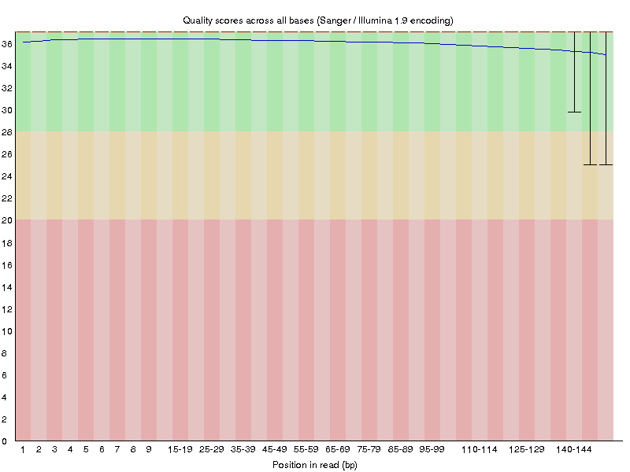
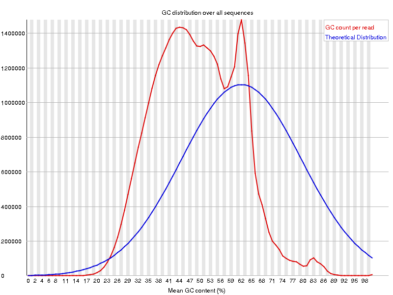
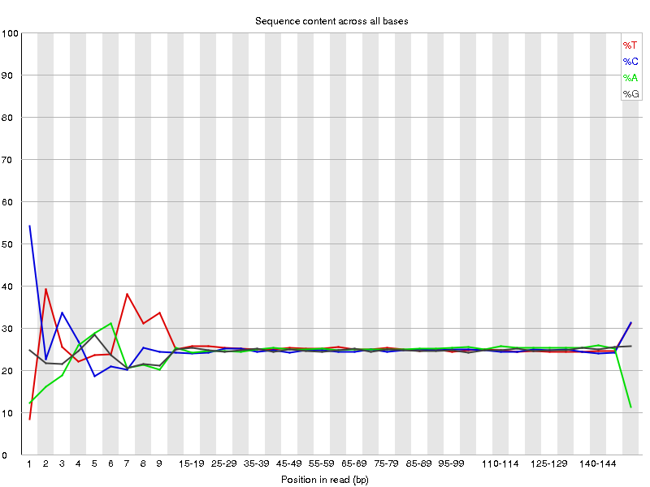

```{r setup, include=FALSE}
knitr::opts_chunk$set(echo = TRUE)
```

This report documents the work undertaken for QC for star bam and kallisto's psedobam.

### Extract unmapped reads from bam file

For QC check, it might be a good idea to clean-up the data first by removing unmapped reads from the bam file. 

The command used is:

```
samtools view -b -F 4 input.bam > output.mapped.bam
    -b output bam file
    -F Do not output alignments with any bits set in INT present in the FLAG field. 
     4 SAM flag value for read unmapped
```

The output file for star and kallistto are located under (respectively):

```
/data/cephfs/punim0010/projects/Kanwal_RNASeq_Testing/seqc-test/rna-seq/work/align/RNA-Test-kallisto/RNA-Test-kallisto_star/RNA-Test-kallisto.mapped.bam

/data/cephfs/punim0010/projects/Kanwal_RNASeq_Testing/seqc-test/rna-seq/work/kallisto/RNA-Test-kallisto/pseudoalignment/pseudoalignments.sorted.mapped.bam
```

*Note*:

Interestingly, kallisto bam file had more un-mapped reads as the file size reduced from 2.1G to 1.4G. On the other hand, star bam file remained roughly the same size (2.2G -> 2.1G). Need to investigate this further.

Running `samtools flagstats` on star bam file produces the following output.

```
48967081 + 0 in total (QC-passed reads + QC-failed reads)
3077887 + 0 secondary
26247 + 0 supplementary
0 + 0 duplicates
48231706 + 0 mapped (98.50% : N/A)
45862947 + 0 paired in sequencing
22931472 + 0 read1
22931475 + 0 read2
45057520 + 0 properly paired (98.24% : N/A)
45127464 + 0 with itself and mate mapped
108 + 0 singletons (0.00% : N/A)
32314 + 0 with mate mapped to a different chr
32314 + 0 with mate mapped to a different chr (mapQ>=5)
```

98.5% of the total reads are mapped (which explains why the difference of size after removing unmapped reads is negligible).

Running `samtools flagstats` on kallisto ba, produces the following output.

```
49077810 + 0 in total (QC-passed reads + QC-failed reads)
3214860 + 0 secondary
0 + 0 supplementary
0 + 0 duplicates
38828548 + 0 mapped (79.12% : N/A)
45862950 + 0 paired in sequencing
22931475 + 0 read1
22931475 + 0 read2
35252004 + 0 properly paired (76.86% : N/A)
35252004 + 0 with itself and mate mapped
361684 + 0 singletons (0.79% : N/A)
0 + 0 with mate mapped to a different chr
0 + 0 with mate mapped to a different chr (mapQ>=5)
```

79.12% of the total reads are mapped (which further explains why there is a significant difference in sizes of the file after removing unmapped reads).

### FastQC

The summary of the FastQC result for both bam files is shown below.

| Summary                | Star-Bam   | Kallisto-Bam
|------------------------|-------------|--------------|
| `Basic Statistics`     |  PASS  | PASS  |
| `Per base sequence quality`   | PASS  | PASS  |
| `Per tile sequence quality`    | PASS  | PASS |
| `Per base sequence content`     | FAIL     | FAIL   |
| `Per sequence GC content` | FAIL            | FAIL  |
| `Sequence Length Distribution`  |  PASS  | PASS  |
| `Overrepresented sequences` | PASS  | PASS  |
| `Adapter Content`     | PASS  | PASS  |

#### Per base sequence quality in both bams look nice

*Star*

```{r, out.width = "600px"}
knitr::include_graphics("./images/fastqc/star-base-sequence-quality.png")
```

*Kallisto*

```{r, out.width = "600px"}

```

#### Including the failed matrices plots

*Star*

```{r, out.width = "600px"}
knitr::include_graphics("./images/fastqc/star-base-sequence-content.png")

```

*Kallisto*

```{r, out.width = "600px"}

knitr::include_graphics("./images/fastqc/kallisto-GC-content.png")
```

### RSeQC

Some of the modules in RSeQC package require a 12 column bed file. These columns correspond to:

1. `chrom` - The name of the chromosome (e.g. chr3, chrY, chr2_random) or scaffold (e.g. scaffold10671).
2. `chromStart` - The starting position of the feature in the chromosome or scaffold. The first base in a chromosome is numbered 0.
3. `chromEnd` - The ending position of the feature in the chromosome or scaffold.
4. `name` - Defines the name of the BED line.
5. `score` - A score between 0 and 1000. 
6. `strand` - Defines the strand. Either "." (=no strand) or "+" or "-".
7. `thickStart` - The starting position at which the feature is drawn thickly (for example, the start codon in gene displays). When there is no thick part, thickStart and thickEnd are usually set to the chromStart position.
8. `thickEnd` - The ending position at which the feature is drawn thickly (for example the stop codon in gene displays).
9. `itemRgb` - An RGB value of the form R,G,B (e.g. 255,0,0).
10. `blockCount` - The number of blocks (exons) in the BED line.
11. `blockSizes` - A comma-separated list of the block sizes. The number of items in this list should correspond to blockCount.
12. `blockStarts` - A comma-separated list of block starts. All of the blockStart positions should be calculated relative to chromStart. 

The `.bed` file that comes with bcbio installation has 5 columns (e.g.):

```
1	11869	14409	DDX11L1	.	+
1	11872	14412	DDX11L1	.	+
1	11874	14409	DDX11L1	.	+
1	12010	13670	DDX11L1	.	+
1	14363	29370	WASH7P	.	-
```

On the web, there are a couple of ways to convert a gtf file to a bed file.

1. Use bedops - gtf2bed module (http://bedops.readthedocs.io/en/latest/content/reference/file-management/conversion/gtf2bed.html#downloads)

2. Use a perl script - recommended by RSeQC (https://github.com/ExpressionAnalysis/ea-utils/blob/master/clipper/gtf2bed)

**BEDOPS - gtf2bed**

The conda package is installed under `/home/sehrishk/.miniconda3/envs/bedops`. The output bed (`ref-transcripts.bed`) from this module is located under `/data/cephfs/punim0010/projects/Kanwal_RNASeq_Testing/RSeQC`.

Initially, it threw an error when trying to run `gtf2bed` module on `/data/cephfs/punim0010/local/development/bcbio/genomes/Hsapiens/GRCh37/rnaseq/ref-transcripts.gtf`.

Resolved this using https://www.biostars.org/p/206342/. The command used was:

`awk '{ if ($0 ~ "transcript_id") print $0; else print $0" transcript_id \"\";"; }' /data/cephfs/punim0010/local/development/bcbio/genomes/Hsapiens/GRCh37/rnaseq/ref-transcripts.gtf | /home/sehrishk/.miniconda3/envs/bedops/bin/gtf2bed - > ref-transcripts.bed`. The head of the bed file is:

```
1       11868   12227   ENSG00000223972 .       +       processed_transcript    exon    .       exon_number "1"; transcript_source "havana"; gene_id "ENSG00000223972"; exon_id "ENSE00002234944"; gene_source "ensembl_havana"; transcript_id "ENST00000456328"; gene_biotype "pseudogene"; transcript_name "DDX11L1-002"; gene_name "DDX11L1";
1       11868   14409   ENSG00000223972 .       +       processed_transcript    transcript      .       transcript_source "havana"; gene_id "ENSG00000223972"; gene_source "ensembl_havana"; transcript_name "DDX11L1-002"; gene_biotype "pseudogene"; transcript_id "ENST00000456328"; gene_name "DDX11L1";
1       11868   14412   ENSG00000223972 .       +       pseudogene      gene    .       gene_source "ensembl_havana"; gene_biotype "pseudogene"; gene_id "ENSG00000223972"; gene_name "DDX11L1"; transcript_id "";
```

Presuming the `.bed` file can now be used in one of the RSeQC module. I tested it with `inner_distance.py` module. It threw an error `input bed must be 12-column`. As can be noted from the head of the bed file above, `gtf2bed` produced a 10 column bed file from the input gtf file.

**Perl script**

The usage of `gtf2bed` perl is `perl gtf2bed.pl input.gtf > output.bed`.

The head of the output bed file `/data/cephfs/punim0010/projects/Kanwal_RNASeq_Testing/RSeQC/ref-transcripts12.bed` is:

```
1	11871	14412	ENST00000515242	0	+	11871	14412	0	3	356,109,1188,	0,741,1353,
1	11873	14409	ENST00000518655	0	+	11873	14409	0	4	354,127,253,749,	0,721,1529,1787,
1	12009	13670	ENST00000450305	0	+	12009	13670	0	6	48,49,85,78,154,218,	0,169,603,965,1211,1443,
1	14362	24886	ENST00000541675	0	-	14362	24886	0	9	467,69,202,132,7,137,147,102,153,	0,607,2491,2870,3135,3243,3552,3905,10371,
1	14362	29370	ENST00000423562	0	-	14362	29370	0	10	467,69,152,159,198,136,137,147,154,50,	0,607,1433,2244,2495,2870,3243,3552,10375,14958,
```

Running the RSeQC module `inner_distance.py` with the output bed file from the perl script ran successfully :relieved: 


