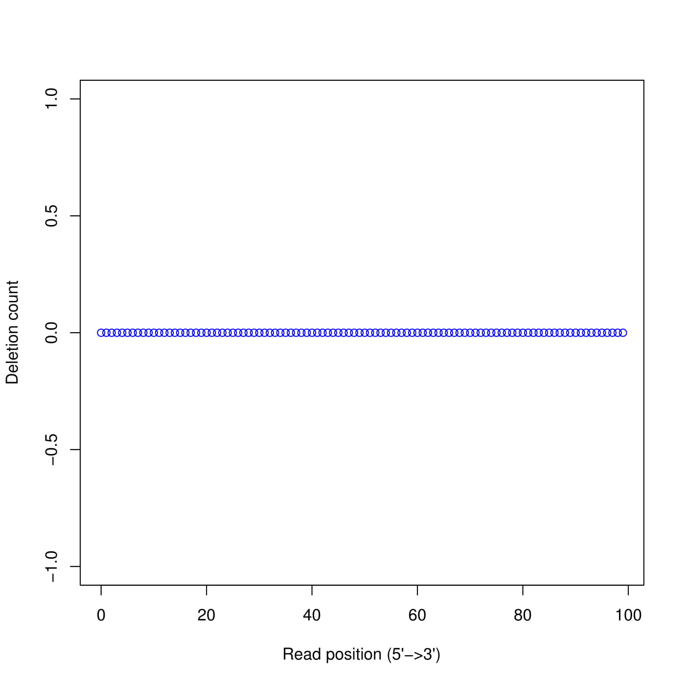

This report documents the work undertaken regarding QC for star bam and kallisto's psedobam.

### Extract unmapped reads from bam file

For QC check, it might be a good idea to clean-up the data first by removing unmapped reads from the bam file. 

The command used is:

```
samtools view -b -F 4 input.bam > output.mapped.bam
    -b output bam file
    -F Do not output alignments with any bits set in INT present in the FLAG field. 
     4 SAM flag value for read unmapped
```

The output file for star and kallistto are located under (respectively):

```
/data/cephfs/punim0010/projects/Kanwal_RNASeq_Testing/seqc-test/rna-seq/work/align/RNA-Test-kallisto/RNA-Test-kallisto_star/RNA-Test-kallisto.mapped.bam

/data/cephfs/punim0010/projects/Kanwal_RNASeq_Testing/seqc-test/rna-seq/work/kallisto/RNA-Test-kallisto/pseudoalignment/pseudoalignments.sorted.mapped.bam
```

*Note*:

Interestingly, kallisto bam file had more un-mapped reads as the file size reduced from 2.1G to 1.4G. On the other hand, star bam file remained roughly the same size (2.2G -> 2.1G). Need to investigate this further.

Running `samtools flagstats` on star bam file produces the following output.

```
48967081 + 0 in total (QC-passed reads + QC-failed reads)
3077887 + 0 secondary
26247 + 0 supplementary
0 + 0 duplicates
48231706 + 0 mapped (98.50% : N/A)
45862947 + 0 paired in sequencing
22931472 + 0 read1
22931475 + 0 read2
45057520 + 0 properly paired (98.24% : N/A)
45127464 + 0 with itself and mate mapped
108 + 0 singletons (0.00% : N/A)
32314 + 0 with mate mapped to a different chr
32314 + 0 with mate mapped to a different chr (mapQ>=5)
```

98.5% of the total reads are mapped (which explains why the difference of size after removing unmapped reads is negligible).

Running `samtools flagstats` on kallisto bam, produces the following output.

```
49077810 + 0 in total (QC-passed reads + QC-failed reads)
3214860 + 0 secondary
0 + 0 supplementary
0 + 0 duplicates
38828548 + 0 mapped (79.12% : N/A)
45862950 + 0 paired in sequencing
22931475 + 0 read1
22931475 + 0 read2
35252004 + 0 properly paired (76.86% : N/A)
35252004 + 0 with itself and mate mapped
361684 + 0 singletons (0.79% : N/A)
0 + 0 with mate mapped to a different chr
0 + 0 with mate mapped to a different chr (mapQ>=5)
```

79.12% of the total reads are mapped (which further explains why there is a significant difference in sizes of the file after removing unmapped reads).

### Summary of statistics


|Sample  |Total Reads |Mapped Reads  |Properly Paired|
|--------|------------|--------------|---------------|
|Star.bam|  48967081  |48231706 (98.50%) |45057520 (98.24%)|
|Kallisto.bam  |49077810  |38828548 (79.12%) |35252004 (76.86%)|

### FastQC

The summary of the FastQC result for both bam files is shown below.

| Summary                | Star-Bam   | Kallisto-Bam  |
|------------------------|-------------|--------------|
| `Basic Statistics`     |  PASS  | PASS  |
| `Per base sequence quality`   | PASS  | PASS  |
| `Per tile sequence quality`    | PASS  | PASS |
| `Per base sequence content`     | FAIL     | FAIL   |
| `Per sequence GC content` | FAIL            | FAIL  |
| `Sequence Length Distribution`  |  PASS  | PASS  |
| `Overrepresented sequences` | PASS  | PASS  |
| `Adapter Content`     | PASS  | PASS  |

#### Per base sequence quality in both bams look nice

*Star*


```r

```


*Kallisto*


```r
knitr::include_graphics("./images/fastqc/kallisto-base-sequence-quality.png")
```


#### Including the failed matrices plots

*Star*


```r

```


```r
knitr::include_graphics("./images/fastqc/star-GC-content.png")
```


*Kallisto*


```r
knitr::include_graphics("./images/fastqc/kallisto-base-sequence-content.png")
```


```r

```


### RSeQC

Some of the modules in RSeQC package require a 12 column bed file. These columns correspond to:

1. `chrom` - The name of the chromosome (e.g. chr3, chrY, chr2_random) or scaffold (e.g. scaffold10671).
2. `chromStart` - The starting position of the feature in the chromosome or scaffold. The first base in a chromosome is numbered 0.
3. `chromEnd` - The ending position of the feature in the chromosome or scaffold.
4. `name` - Defines the name of the BED line.
5. `score` - A score between 0 and 1000. 
6. `strand` - Defines the strand. Either "." (=no strand) or "+" or "-".
7. `thickStart` - The starting position at which the feature is drawn thickly (for example, the start codon in gene displays). When there is no thick part, thickStart and thickEnd are usually set to the chromStart position.
8. `thickEnd` - The ending position at which the feature is drawn thickly (for example the stop codon in gene displays).
9. `itemRgb` - An RGB value of the form R,G,B (e.g. 255,0,0).
10. `blockCount` - The number of blocks (exons) in the BED line.
11. `blockSizes` - A comma-separated list of the block sizes. The number of items in this list should correspond to blockCount.
12. `blockStarts` - A comma-separated list of block starts. All of the blockStart positions should be calculated relative to chromStart. 

The `.bed` file that comes with bcbio installation has 5 columns (e.g.):

```
1	11869	14409	DDX11L1	.	+
1	11872	14412	DDX11L1	.	+
1	11874	14409	DDX11L1	.	+
1	12010	13670	DDX11L1	.	+
1	14363	29370	WASH7P	.	-
```

On the web, there are a couple of ways to convert a gtf file to a bed file.

1. Use bedops - gtf2bed module (http://bedops.readthedocs.io/en/latest/content/reference/file-management/conversion/gtf2bed.html#downloads)

2. Use a perl script - recommended by RSeQC (https://github.com/ExpressionAnalysis/ea-utils/blob/master/clipper/gtf2bed)

**BEDOPS - gtf2bed**

The conda package is installed under `/home/sehrishk/.miniconda3/envs/bedops`. The output bed (`ref-transcripts.bed`) from this module is located under `/data/cephfs/punim0010/projects/Kanwal_RNASeq_Testing/RSeQC`.

Initially, it threw an error when trying to run `gtf2bed` module on `/data/cephfs/punim0010/local/development/bcbio/genomes/Hsapiens/GRCh37/rnaseq/ref-transcripts.gtf`.

Resolved this using https://www.biostars.org/p/206342/. The command used was:

`awk '{ if ($0 ~ "transcript_id") print $0; else print $0" transcript_id \"\";"; }' /data/cephfs/punim0010/local/development/bcbio/genomes/Hsapiens/GRCh37/rnaseq/ref-transcripts.gtf | /home/sehrishk/.miniconda3/envs/bedops/bin/gtf2bed - > ref-transcripts.bed`. The head of the bed file is:

```
1       11868   12227   ENSG00000223972 .       +       processed_transcript    exon    .       exon_number "1"; transcript_source "havana"; gene_id "ENSG00000223972"; exon_id "ENSE00002234944"; gene_source "ensembl_havana"; transcript_id "ENST00000456328"; gene_biotype "pseudogene"; transcript_name "DDX11L1-002"; gene_name "DDX11L1";
1       11868   14409   ENSG00000223972 .       +       processed_transcript    transcript      .       transcript_source "havana"; gene_id "ENSG00000223972"; gene_source "ensembl_havana"; transcript_name "DDX11L1-002"; gene_biotype "pseudogene"; transcript_id "ENST00000456328"; gene_name "DDX11L1";
1       11868   14412   ENSG00000223972 .       +       pseudogene      gene    .       gene_source "ensembl_havana"; gene_biotype "pseudogene"; gene_id "ENSG00000223972"; gene_name "DDX11L1"; transcript_id "";
```

Presuming the `.bed` file can now be used in one of the RSeQC module. I tested it with `inner_distance.py` module. It threw an error `input bed must be 12-column`. As can be noted from the head of the bed file above, `gtf2bed` produced a 10 column bed file from the input gtf file.

**Perl script**

The usage of `gtf2bed` perl is `perl gtf2bed.pl input.gtf > output.bed`.

The head of the output bed file `/data/cephfs/punim0010/projects/Kanwal_RNASeq_Testing/RSeQC/ref-transcripts12.bed` is:

```
1	11871	14412	ENST00000515242	0	+	11871	14412	0	3	356,109,1188,	0,741,1353,
1	11873	14409	ENST00000518655	0	+	11873	14409	0	4	354,127,253,749,	0,721,1529,1787,
1	12009	13670	ENST00000450305	0	+	12009	13670	0	6	48,49,85,78,154,218,	0,169,603,965,1211,1443,
1	14362	24886	ENST00000541675	0	-	14362	24886	0	9	467,69,202,132,7,137,147,102,153,	0,607,2491,2870,3135,3243,3552,3905,10371,
1	14362	29370	ENST00000423562	0	-	14362	29370	0	10	467,69,152,159,198,136,137,147,154,50,	0,607,1433,2244,2495,2870,3243,3552,10375,14958,
```
The column values definetely make more sense according to description of the bed columns above.

Running the RSeQC module `inner_distance.py` with the output bed file from the perl script ran successfully :boom: 

#### Including output of few RSeQC modules

**Inputs**

1. Star bam - /data/cephfs/punim0010/projects/Kanwal_RNASeq_Testing/seqc-test/rna-seq/work/align/RNA-Test-kallisto/RNA-Test-kallisto_star/RNA-Test-kallisto.mapped.bam

2. Kallisto bam - /data/cephfs/punim0010/projects/Kanwal_RNASeq_Testing/seqc-test/rna-seq/work/kallisto/RNA-Test-kallisto/pseudoalignment/pseudoalignments.sorted.mapped.bam

3. bed file - /data/cephfs/punim0010/projects/Kanwal_RNASeq_Testing/RSeQC/ref-transcripts12.bed

**Clipping profile**

This program is used to estimate clipping profile of RNA-seq reads from BAM or SAM file. Note that to use this funciton, CIGAR strings within SAM/BAM file should have ‘S’ operation (This means your reads aligner should support clipped mapping). ‘S’ stands for *soft clipping*. Soft-clipped bases in 5' and 3' of the read are NOT part of the alignment but are also not removed from the read sequence in the bam file. Quoting, https://www.biostars.org/p/109333/

Hard masked bases do not appear in the SEQ string, soft masked bases do.

So, if your cigar is: `10H10M10H` then the SEQ will only be 10 bases long.

if your cigar is `10S10M10S` then the SEQ and base-quals will be 30 bases long.

In the case of soft-masking, even though the SEQ is present, it is not used by variant callers and not displayed when you view your data in a viewer. In either case, masked bases should not be used in calculating coverage

*Star bam*


*kallisto bam*


**Deletion profile**

Calculate the distributions of deletions across reads (left - kallisto | right - star). Deletion in CIGAR string is indicated with ‘D’.

Interestingly, there are no deletions in the pseudoaligned reads to reference. Also, in star total reads used were `69828`.



**Insertion profile**

Calculate the distributions of inserted nucleotides across reads. Note that to use this funciton, CIGAR strings within SAM/BAM file should have ‘I’ operation. No insertions in kallisto's psedobam again.

*Star bam*


*kallisto bam*


**Mismatch profile**

Calculate the distribution of mismatches across reads. Note that the “MD” tag must exist in BAM file.

No mismatches were found in kallisto's pseudo bam. The mismatch profile for star is:


**Read quality**

According to SAM specification, if Q is the character to represent “base calling quality” in SAM file, then Phred Quality Score = ord(Q) - 33. Here ord() is python function that returns an integer representing the Unicode code point of the character when the argument is a unicode object, for example, ord(‘a’) returns 97. Phred quality score is widely used to measure “reliability” of base-calling, for example, phred quality score of 20 means there is 1/100 chance that the base-calling is wrong, phred quality score of 30 means there is 1/1000 chance that the base-calling is wrong. In general: Phred quality score = -10xlog(10)P, here P is probability that base-calling is wrong.

*This function is taking forever to run*


**Read nucleotide versus cycle**

This module is used to check the nucleotide composition bias. Due to random priming, certain patterns are over represented at the beginning (5’end) of reads. This bias could be easily examined by NVC (Nucleotide versus cycle) plot. NVC plot is generated by overlaying all reads together, then calculating nucleotide composition for each position of read (or each sequencing cycle). In ideal condition (genome is random and RNA-seq reads is randomly sampled from genome), we expect A%=C%=G%=T%=25% at each position of reads.


**Read distribution**

Provided a BAM/SAM file and reference gene model, this module will calculate how mapped reads were distributed over genome feature (like CDS exon, 5’UTR exon, 3’ UTR exon, Intron, Intergenic regions). When genome features are overlapped (e.g. a region could be annotated as both exon and intron by two different transcripts) , they are prioritize as: CDS exons > UTR exons > Introns > Intergenic regions, for example, if a read was mapped to both CDS exon and intron, it will be assigned to CDS exons.

“Total Reads”: This does NOT include those QC fail,duplicate and non-primary hit reads
“Total Tags”: reads spliced once will be counted as 2 tags, reads spliced twice will be counted as 3 tags, etc. And because of this, “Total Tags” >= “Total Reads”
“Total Assigned Tags”: number of tags that can be unambiguously assigned the 10 groups (see below table).
Tags assigned to “TSS_up_1kb” were also assigned to “TSS_up_5kb” and “TSS_up_10kb”, tags assigned to “TSS_up_5kb” were also assigned to “TSS_up_10kb”. Therefore, “Total Assigned Tags” = CDS_Exons + 5’UTR_Exons + 3’UTR_Exons + Introns + TSS_up_10kb + TES_down_10kb.
When assign tags to genome features, each tag is represented by its middle point.

RSeQC cannot assign those reads that:

  - hit to intergenic regions that beyond region starting from TSS upstream 10Kb to TES downstream 10Kb.
  - hit to regions covered by both 5’UTR and 3’ UTR. This is possible when two head-to-tail transcripts are overlapped in UTR regions.
  - hit to regions covered by both TSS upstream 10Kb and TES downstream 10Kb.

*Star bam*

```
Total Reads                   45153819
Total Tags                    63935624
Total Assigned Tags           63250302
=====================================================================
Group               Total_bases         Tag_count           Tags/Kb
CDS_Exons           91580586            47082418            514.11
5'UTR_Exons         4995660             540403              108.17
3'UTR_Exons         25502950            6290145             246.64
Introns             1444013596          8391736             5.81
TSS_up_1kb          30471682            40576               1.33
TSS_up_5kb          136132250           93772               0.69
TSS_up_10kb         243944946           136549              0.56
TES_down_1kb        32230571            535591              16.62
TES_down_5kb        139934720           723262              5.17
TES_down_10kb       247003814           809051              3.28
=====================================================================
```

*kallisto bam*

```
Total Reads                   35613688
Total Tags                    54292203
Total Assigned Tags           54146182
=====================================================================
Group               Total_bases         Tag_count           Tags/Kb
CDS_Exons           91580586            47408525            517.67
5'UTR_Exons         4995660             543933              108.88
3'UTR_Exons         25502950            6178616             242.27
Introns             1444013596          14435               0.01
TSS_up_1kb          30471682            204                 0.01
TSS_up_5kb          136132250           204                 0.00
TSS_up_10kb         243944946           204                 0.00
TES_down_1kb        32230571            469                 0.01
TES_down_5kb        139934720           469                 0.00
TES_down_10kb       247003814           469                 0.00
=====================================================================
```

**Junction annotation**

For a given alignment file (-i) in BAM or SAM format and a reference gene model (-r) in BED format, this program will compare detected splice junctions to reference gene model. splicing annotation is performed in two levels: splice event level and splice junction level.

  - splice read: An RNA read, especially long read, can be spliced more than once, therefore, 100 spliced reads can produce >= 100 splicing events.
  - splice junction: multiple splicing events spanning the same intron can be consolidated into one splicing junction.

Detected junctions were divided to 3 exclusive categories:

1. Annotated (known): The junction is part of the gene model. Both splice sites, 5’ splice site (5’SS) and 3’splice site (3’SS) are annotated by reference gene model.
2. Complete_novel: Both 5’SS and 3’SS are novel.
3. Partial_novel: One of the splice site (5’SS or 3’SS) is novel, and the other splice site is annotated

*star bam*

```
total = 17805299

===================================================================
Total splicing  Events:	17805299
Known Splicing Events:	17643832
Partial Novel Splicing Events:	111729
Novel Splicing Events:	44725

Total splicing  Junctions:	230686
Known Splicing Junctions:	179604
Partial Novel Splicing Junctions:	37594
Novel Splicing Junctions:	13488

===================================================================
```


*kallisto bam*

```
total = 18678515

===================================================================
Total splicing  Events:	18678515
Known Splicing Events:	18674408
Partial Novel Splicing Events:	0
Novel Splicing Events:	0

Total splicing  Junctions:	195096
Known Splicing Junctions:	195096
Partial Novel Splicing Junctions:	0
Novel Splicing Junctions:	0

===================================================================
```


