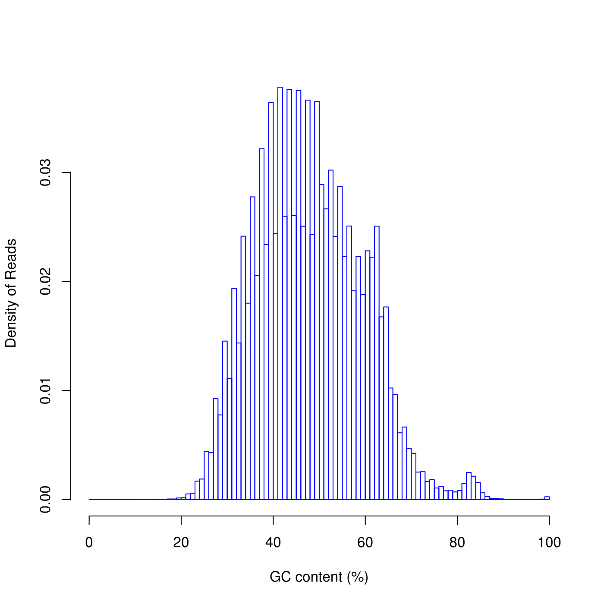
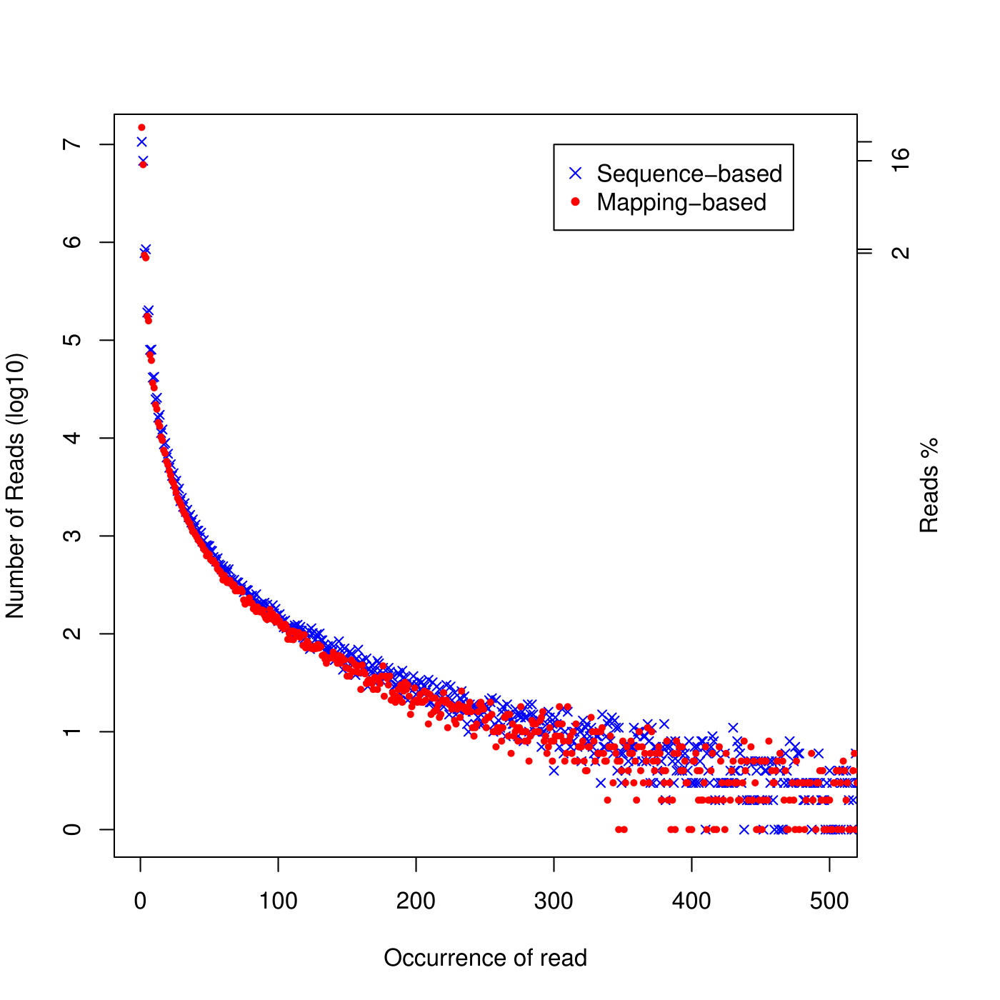
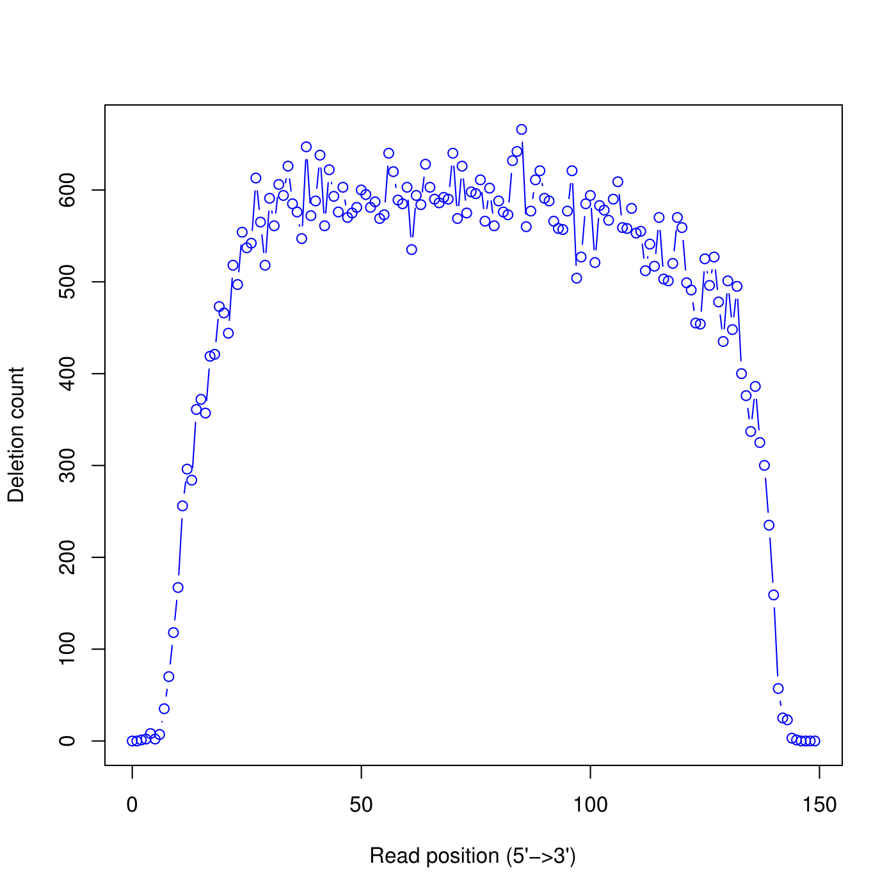
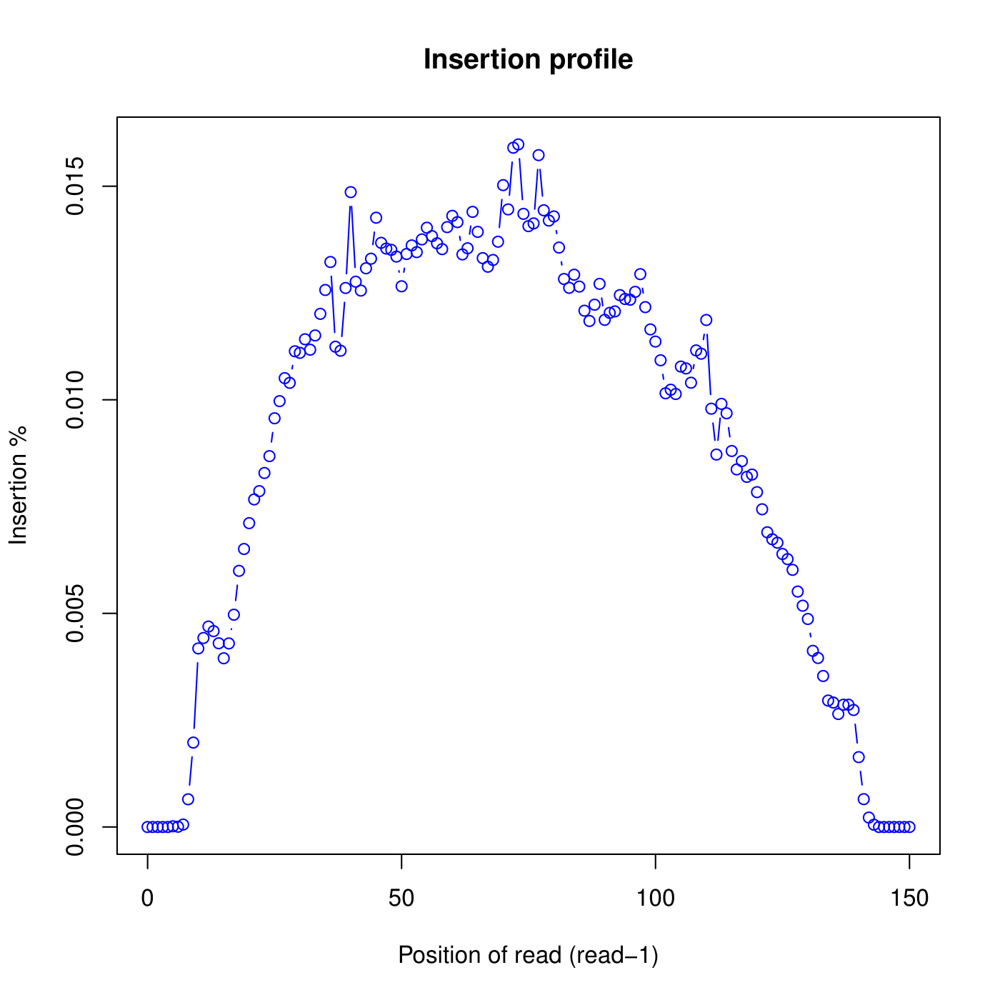
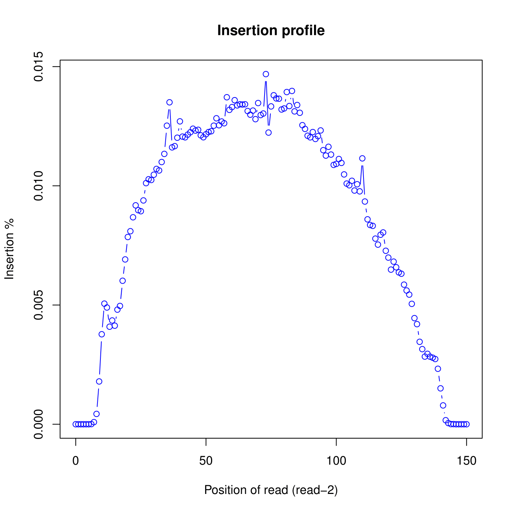
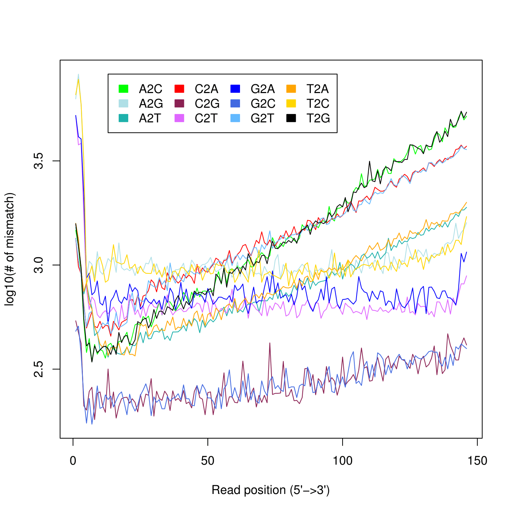

This report uses http://rseqc.sourceforge.net/ tool for the analysis. I have set it up on spartan and used its conda package https://anaconda.org/bioconda/rseqc. It is available under the environment `/home/sehrishk/.miniconda3/envs/rna/`.

**1. Summarizing mapping statistics of a BAM**

This script determines “uniquely mapped reads” from mapping quality (Mapping Quality Scores quantify the probability that a read is misplaced).

```
/home/sehrishk/.miniconda3/envs/rna/bin/bam_stat.py -i /data/cephfs/punim0010/projects/Kanwal_RNASeq_Testing/seqc-test/rna-seq/config/align/RNA-Test-kallisto/RNA-Test-kallisto_star/RNA-Test-kallisto.bam
```
Output:

```
Load BAM file ...  Done

All numbers are READ count

Total records:                          48967081

QC failed:                              0
Optical/PCR duplicate:                  0
Non primary hits                        3077887
Unmapped reads:                         735375
mapq < mapq_cut (non-unique):           2212511

mapq >= mapq_cut (unique):              42941308
Read-1:                                 21472883
Read-2:                                 21468425
Reads map to '+':                       21477593
Reads map to '-':                       21463715
Non-splice reads:                       28372855
Splice reads:                           14568453
Reads mapped in proper pairs:           42845044
Proper-paired reads map to different chrom:0
```
**2. GC content distribution of reads**

```
/home/sehrishk/.miniconda3/envs/rna/bin/read_GC.py -i /data/cephfs/punim0010/projects/Kanwal_RNASeq_Testing/seqc-test/rna-seq/config/align/RNA-Test-kallisto/RNA-Test-kallisto_star/RNA-Test-kallisto.bam -o output
```
Output:

Includes three files:

* GC.xls: Two column, plain text file, first column is GC%, second column is read count

* output.GC_plot.r: R script to generate pdf file.

* output.GC_plot.pdf: graphical output generated from R script.


```r

```


**3. Determine reads duplication rate**

Two strategies were used to determine reads duplication rate: 

* Sequence based: reads with identical sequence are regarded as duplicated reads. 

* Mapping based: reads mapped to the exactly same genomic location are regarded as duplicated reads. For splice reads, reads mapped to the same starting position and splice the same way are regarded as duplicated reads.

```
/home/sehrishk/.miniconda3/envs/rna/bin/read_duplication.py -i /data/cephfs/punim0010/projects/Kanwal_RNASeq_Testing/seqc-test/rna-seq/config/align/RNA-Test-kallisto/RNA-Test-kallisto_star/RNA-Test-kallisto.bam -o duplication
```
Output:

Includes 4 files

* output.dup.pos.DupRate.xls: Read duplication rate determined from mapping position of read. First column is “occurrence” or duplication times, second column is number of uniquely mapped reads.

* output.dup.seq.DupRate.xls: Read duplication rate determined from sequence of read. First column is “occurrence” or duplication times, second column is number of uniquely mapped reads.

* output.DupRate_plot.r: R script to generate pdf file

* output.DupRate_plot.pdf: Graphical output generated from R script


```r

```


**4. Calculate the distribution of deletions across reads**

```
/home/sehrishk/.miniconda3/envs/rna/bin/deletion_profile.py -i /data/cephfs/punim0010/projects/Kanwal_RNASeq_Testing/seqc-test/rna-seq/config/align/RNA-Test-kallisto/RNA-Test-kallisto_star/RNA-Test-kallisto.bam -l 150 -n 48967081 -o deletion
```
Output:

Includes three files:

* output.deletion_profile.txt: A text file with the deletion profile for bam

* output.deletion_profile.r: R script to generate pdf file

* output.deletion_profile.pdf: Graphical output generated from R script

NOTE: It says "Process BAM file ...  Total reads used: 69828". Overriding this value by providing an explicit input with "-n" didn't change it.:confused:


```r
  
```


**5. Calculate the distributions of inserted nucleotides across reads**

```
/home/sehrishk/.miniconda3/envs/rna/bin/insertion_profile.py -s "PE" -i /data/cephfs/punim0010/projects/Kanwal_RNASeq_Testing/seqc-test/rna-seq/config/align/RNA-Test-kallisto/RNA-Test-kallisto_star/RNA-Test-kallisto.nsorted.bam -o output
```
Output:

Includes four files:

* output.insertion_profile.xls: An excel file with the insertion profile for bam

* output.insertion_profile.r: R script to generate pdf file

* output.insertion_profile.R1.pdf: Graphical output generated from R script for R1

* output.insertion_profile.R2.pdf: Graphical output generated from R script for R2


```r

```


```r

```


**6. Calculate the distribution of mismatches across reads.**

Includes three files:

* output.mismatch_profile.xls: An excel file with the mismatch profile for bam: 

* output.mismatch_profile.r: R script to generate pdf file

* output.mismatch_profile.pdf: Graphical output generated from R script

```
/home/sehrishk/.miniconda3/envs/rna/bin/mismatch_profile.py -l 150 -n 48967081 -i /data/cephfs/punim0010/projects/Kanwal_RNASeq_Testing/seqc-test/rna-seq/config/align/RNA-Test-kallisto/RNA-Test-kallisto_star/RNA-Test-kallisto.nsorted.bam -o output
```
Output:


```r

```


